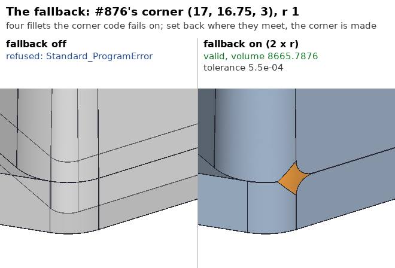
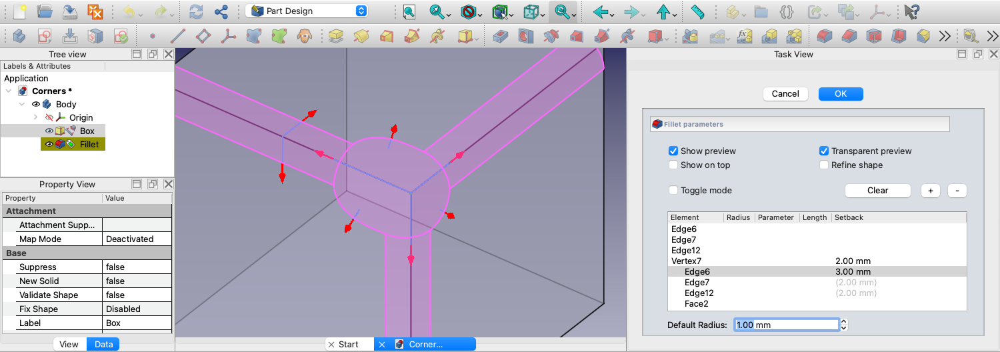
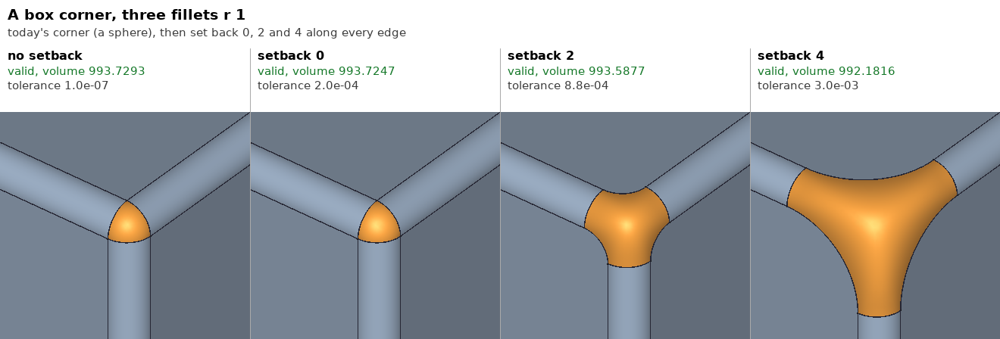
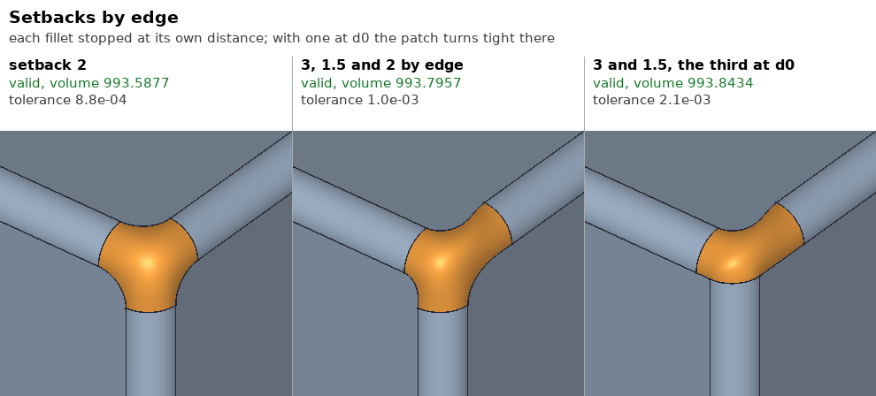
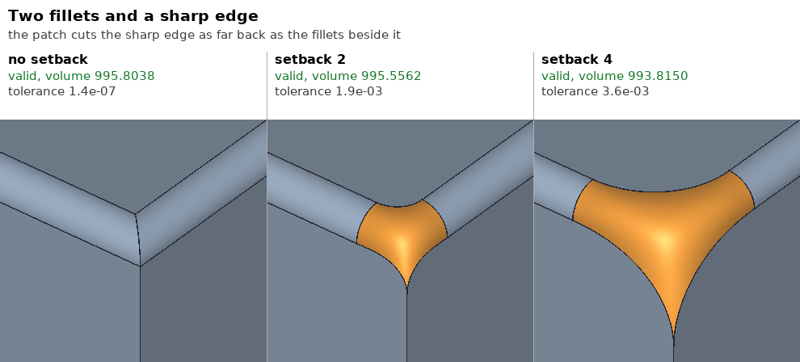

# Corner Blending -- setback vertex blends for fillets

Status: the OCCT side of phases 1 and 2 is implemented, as the fillet's
fallback first (section 9), the Part API of phase 3 (section 9.4), the
PartDesign property of phase 4 (section 9.5) and the task panel of phase 5
(section 9.6); the patch's quality at large setbacks and the pictures are
section 9.7.

Request: realthunder/FreeCAD_assembly3#894, "[FR] Blend Corner feature"
(2021-11). Related: #917 (variable radius; the fork's fillet has per-edge
`Segments` since), #677 (tangent-constrained surface between curves).

## 1. What is asked

Where several filleted edges meet at a vertex, today's fillet ends each
stripe where it runs into the others and fills the small hole left between
them. The issue's pictures (from another CAD's "Blend Corner") show the
alternative: each fillet is **set back** along its edge -- cut off a chosen
distance before the vertex -- and the much larger opening is filled with
one smooth patch, tangent to the fillets it meets and to the faces between
them. The result is a softer, rounder corner whose size the user controls
per edge, independently of the radii.

The issue thread adds:

- One commenter asked for a corner *type* drop-down (chamfer / miter /
  blend), as in some CAD packages' chamfer dialogs.
- realthunder (2021-11) suggested OCCT's multi-radius fillet might cover part
  of it. The reporter replied that it does not: a setback corner works for
  any number of edges and on curved faces, and it is not a radius change.
  The fork has since gained per-edge radius segments (`PropertyFilletSegments`);
  they stay separate from this.
- The reporter's manual recipe is blend curve + isocurve + Filling: the same
  construction as section 3 below, done by hand.
- realthunder (2022-02): both this and multi-radius fillet want on-screen
  push/pull handles, which FreeCAD lacked then. That is section 6.

Terms used below, at a corner vertex V:

- `e_1 .. e_n`: the edges at V in cyclic order around it; `F_i` is the face
  between `e_i` and `e_(i+1)`.
- A **stripe** is the fillet surface along a filleted `e_i`. Its end
  **section** is the cross-section curve where it stops. The section's two
  ends are its **contact points** on the two faces of `e_i`.
- `d_i` is the **setback** of `e_i`: the distance from V, measured along the
  edge (the spine), at which its stripe stops. For an edge that is not
  filleted (a **sharp** edge), the corner patch cuts the edge itself at that
  distance.
- A **face curve** `B_i` is a curve on `F_i` joining the end at `e_i` to the
  end at `e_(i+1)`: a contact point, or the cut point of a sharp edge.

The corner patch is bounded by the n sections (or the cut points of sharp
edges) and the n face curves, alternating -- a 2n-sided region, or fewer
where sharp edges give points instead of sections. It is G1 to each stripe
across its section and G1 to each face across its face curve.

## 2. What OCCT does at a vertex today

All in `TKFillet/ChFi3d`. `ChFi3d_Builder::PerformFilletOnVertex` picks a
routine by the number of stripes and edges at the vertex:

| Routine | When | How the corner is filled |
|---|---|---|
| `PerformOneCorner` (`ChFi3d_Builder_C1.cxx`) | one stripe ends at V | the stripe is cut by the face it runs into; no patch |
| `PerformTwoCorner` (`ChFi3d_FilBuilder_C2.cxx`) | two stripes | intersection, a torus (`ChFiKPart`), or a Coons fill along a pivot edge |
| `PerformThreeCorner` (`ChFi3d_FilBuilder_C3.cxx`) | three stripes, three edges | a sphere when it fits (`ChFiKPart_ComputeData::ComputeCorner`), else `GeomFill_ConstrainedFilling` (3-sided) |
| `PerformMoreThreeCorner` (`ChFi3d_Builder_CnCrn.cxx`) | more than three edges, or the others giving up | `GeomPlate` N-sided G1 patch; boundaries are the stripes' end sections and face curves between them |

`PerformMoreThreeCorner` is already the right shape for a setback corner:
its boundaries are exactly the sections plus face curves of section 1, with
setback zero. What it does not have is the setback, and its face curves are
made the fragile way. It builds a 3D Hermite curve between stripe ends and
projects it onto the faces (`CurveHermite`). Or it makes a batten
(`CalculBatten`), or a straight line in UV. The 2026-10 fillet work on this
box fixed four separate failures in exactly that code:

- a projection stored backwards (`3fa9420429`);
- pieces of a curve over several faces in the wrong order (`f1d8509ff6`);
- projected pieces that do not run end to end (`68c5d4efd0`);
- a `GeomPlate` G1 patch folding to keep tangency, with the G0 fallback
  `2b6b625bcb`.

Over 400 of 495 G1 plates in that sweep missed their boundaries by more
than 1e-3. See `~/works/sw/occt/tests/fork/fillet/README.md`. A setback
corner makes the patch larger, which makes all of this matter more.

No public API sets anything per vertex. `BRepFilletAPI_MakeFillet` takes
radii per edge (constant, two-value, `Law_Function`, or (u, r) pairs) and a
fillet shape; `SetRadius(r, IC, V)` sets the radius *at* a vertex, not a
corner.

## 3. OCCT design

### 3.1 API (ABI-safe)

`BRepFilletAPI_MakeFillet` holds its `ChFi3d_FilBuilder` by value, so FreeCAD
compiled against the fork has the builder's layout baked in. The plate G0
threshold went in as a static for that reason (`2b6b625bcb`, "without
breaking ABI"). Setbacks are per contour end, so they go where layout is
private to TKFillet: `ChFiDS_FilSpine`, allocated only inside the builder
and reached through a handle.

New non-virtual exported methods. Adding these does not move any layout:

```
// BRepFilletAPI_MakeFillet
void   SetSetback(const TopoDS_Vertex& V, const TopoDS_Edge& E, double D);
void   SetSetback(const TopoDS_Vertex& V, double D);   // every edge at V
double Setback(const TopoDS_Vertex& V, const TopoDS_Edge& E) const;  // 0 = none
```

A setback on a filleted edge is stored on its contour's spine, at the end
that is V: `ChFiDS_FilSpine::SetSetback(bool isFirst, double)`. A setback
on a sharp edge has no spine; it lives in a vertex-keyed map. That map
would be a new member, so it cannot go on the builder. It goes on the spine
of any stripe that ends at V, which is enough because a corner with no
stripe at all is not a corner. A vertex with any setback set is a
**setback corner**, and every edge at it gets a setback (default below).

**Default setback.** Today's corner, the zero-setback one, already has an
effective setback on each edge: the distance from V at which its stripe
ends. Call it `d0_i`. A setback below `d0_i` is meaningless. So
`d_i = max(requested, d0_i)`, and `SetSetback(V, D)` with D less than every
`d0_i` gives today's corner shape built the new way. That is the useful
regression test of 3.4.

### 3.2 Algorithm

1. **Walk as today.** The stripes are computed to V as they are now. That
   gives `d0_i` and the contact curves near V, which the face curves need
   for their tangents.

2. **Cut each stripe back** to spine abscissa `w_V -+ d_i`. Cut the last
   SurfData there, or drop it and cut the one before. The cutting exists in
   pieces already: `ChFi3d_Builder::Trunc` for the analytic kinds, and the
   corner routines' own surfdata trimming (`RemoveSD` in CnCrn). It has to
   become one helper that leaves the stripe ending in a proper section: the
   isoparametric curve of the fillet surface, its two pcurves on the faces,
   and two `ChFiDS_CommonPoint`s that are not on an arc. A setback that runs
   past the stripe's first surfdata on that edge, or past the edge's other
   end, is an error (3.3).

3. **Route to one routine.** Every setback corner goes to a new
   `PerformSetbackCorner(Index)`, whatever its count of stripes and edges.
   The case table of section 2 stays for ordinary corners. The new routine
   is the N-sided filler with clean inputs. Its core should be lifted out
   of `PerformMoreThreeCorner` (the plate construction, orientation, and DS
   insertion: `PlateOrientation`, the `SolidSurfaceInterference`, the curve
   interferences). It should not be a fifth copy of that code.

4. **Face curves in UV, not projected.** On each `F_i`, build `B_i` directly
   as a 2D curve in the face's parameter space. It runs from the end on
   `e_i` (the stripe's contact point, or a sharp edge's cut point) to the
   end on `e_(i+1)`. Its end tangents are those of the stripes' contact
   curves at those points, mapped to UV through the surface's first
   derivatives, so the patch can be G1 to the stripes at the corners of
   the region. Use a 2D cubic Hermite with the tangent magnitudes scaled to
   the chord, as `CurveHermite` does in 3D. The 3D curve is the curve on
   the surface. Nothing gets projected, which removes the whole class of
   failures listed in section 2.
   - A periodic face (cylinder, sphere) unwraps: take both ends' UV from the
     pcurves of the edges and stripes at V, which already sit on one side
     of the seam, and shift by a period where they straddle it.
   - Check `B_i` against the face with `BRepTopAdaptor_FClass2d` at a few
     samples. A curve that leaves `F_i` means the setback does not fit on
     that face, which is an error (3.3). A face curve that would have to
     cross onto a neighbouring face, the `moresurf` case, is out of scope
     for the first version and is an error too.

5. **Fill.** `GeomPlate_BuildPlateSurface` with one `GeomPlate_CurveConstraint`
   per boundary:
   - each section: order 1, against the stripe surface;
   - each face curve: order 1, against `F_i`;
   - a sharp edge's cut point is a corner of the region, with a
     `GeomPlate_PointConstraint` at it.

   `GeomPlate_MakeApprox`, then the fork's G0 fallback (`PlateG0FallbackRatio`),
   then the boundary-orientation check of `3fa9420429`. For n = 3, all
   filleted, on planes, the plate should come out close to the current
   `GeomFill_ConstrainedFilling` result at setback `d0`. That comparison is
   a test.

6. **DS.** Insert the plate face, its edges shared with the stripes (the
   sections) and with the faces (the face curves: face interferences that
   trim each `F_i`), and the sharp edges trimmed at their cut points. This
   is all done today in CnCrn for the zero-setback plate, and should come
   from the factored code of step 3.

### 3.3 Errors

A setback corner that cannot be built must fail with a status, never leave
an invalid shape behind. The 2026-10 work turned 67 invalid results into
exceptions for this reason. Add `ChFiDS_ErrorStatus` values, or reuse
`ChFiDS_Error` with a faulty vertex, for each of:

- the setback exceeds the edge (it would pass the other end, or meet that
  end's own setback or stripe end);
- the setback runs past the stripe's single surfdata on that edge, when the
  stripe changes faces before V;
- a face curve leaves its face;
- the plate misses a boundary by more than the tolerance, with the G0
  fallback included.

Each one names the vertex, so FreeCAD can point at it.

### 3.4 Tests (in `tests/fork/fillet`, own section)

- A box corner with 3 equal radii, setback equal on all three edges, at
  `d0`, 2x `d0` and 4x `d0`: valid, one closed shell, and volume decreasing
  monotonically with setback.
- The same with unequal setbacks, and with unequal radii.
- At `d0`: the volume within tolerance of today's corner (the sphere, or
  `ConstrainedFilling`).
- A 4-edge vertex (a pyramid apex) and a 5-edge one.
- Mixed: two filleted edges and one sharp edge, so the patch meets the
  sharp edge's cut point.
- Curved faces: a cylinder boss on a plate (the edge circle plus the
  seam-free side), and a corner on a cylinder's seam.
- Every error of 3.3, each with its status.
- Pictures for the doc, same tooling as `models/Fillet.md`.

## 4. FreeCAD side

### 4.1 Part

- `TopoShape::makeElementFillet` (and the older `makEFillet` overloads that
  carry `FilletSegments`) takes one more argument: corner settings, a list
  of `{vertex, default setback, map edge -> setback}`. Element names are
  resolved to vertices and edges of the base shape the same way the
  segments' edge names are. The settings are passed through to
  `BRepFilletAPI_MakeFillet::SetSetback`.
- History: the corner patch face is `Generated` from V. That is the mapped
  element name `Face;:G(Vertex<n>)` or similar, through the existing
  `makeElementShape` path, so a later feature can reference the corner face
  stably.
- The fork's OCCT is the only one with `SetSetback`. Like the plate
  fallback (`AppPartPy setOCCTPlateG0FallbackRatio`, dlsym), resolve it at run
  time. On another OCCT, a setback corner is an error: "corner setback
  needs the fork's OCCT". It must not silently build a different shape.

### 4.2 PartDesign (after the upstream PD port merges)

- `PartDesign::Fillet` gets a `Corners` property next to `Segments`: a new
  `Part::PropertyFilletCorners` in `PropertyDressUp.h`, modelled on
  `PropertyFilletSegments`.
  - Keyed by vertex sub-name (`"Vertex12"`). The value is
    `{setback, {edge sub-name: setback}}`.
  - `connectLinkProperty(Base)`, so the names follow topology changes as
    the segments' names do.
  - Python get/set and path values (`Corners.Vertex12.Setback`) so
    expressions can drive it.
- A vertex is only meaningful if at least one of its edges is in the
  fillet. The feature keeps entries for vertices that drop out (as
  `Segments` does), but ignores them, with a warning.
- Old files have no `Corners` and restore as today. A new file opened by a
  FreeCAD without the property loses the corners and keeps the plain
  fillet. That is the usual PD forward-compat behaviour; no
  `handleChangedPropertyName` needed.
- Chamfer: out of scope. A chamfer corner (`ChFi3d_ChBuilder`) has its own
  corner code. If wanted later, the same API and property apply.

### 4.3 Part workbench

`Part::Fillet` (`PropertyFilletEdges`) can get the same setting later. The
first version is PartDesign only, plus the Python `TopoShape` API, which is
enough to test from scripts and the suite.

## 5. Corner types beyond setback

The drop-down idea from the thread (chamfer / miter / blend corner types)
is a different feature. "Miter" is two stripes extended and cut by a plane
through V. "Chamfer" closes the corner with a flat patch. Both would fit
the same per-vertex property as `Type`, with `Setback` as the first type
beyond `Default`. Do not build them in the first version, but keep the
property's value open for a type field.

## 6. GUI

realthunder's 2022 comment holds: a corner with n setbacks is unusable
without direct manipulation. The task panel shows:

- a corner list (pick a vertex in the 3D view; it is added with the default
  setback);
- per-edge setback fields under each corner;
- one drag handle per edge at the setback point, moving along the edge.
  Same interaction as the segment handles on a variable-radius fillet in
  `TaskFilletParameters` (reuse that code); the preview recomputes on
  release.

The handle position is the stripe's section point on the edge, so it needs
nothing from OCCT beyond the spine abscissa, which `Abscissa` /
`RelativeAbscissa` already give.

## 7. Phases

1. **OCCT prototype.** `PerformSetbackCorner` for all-filleted corners on
   planar faces; the API; a C++ driver; the box-corner tests of 3.4.
   Compare against today's corner at `d0`.
2. **OCCT general.** Sharp edges at the corner, curved and periodic faces,
   the 3.3 errors, the full 3.4 set; the every-edge and vertex sweeps
   unchanged for corners without setbacks. That last point holds by
   construction, because nothing routes to the new code without a
   setback; the sweeps prove it.
3. **Part API.** `makeElementFillet` corner settings, dlsym guard, Python.
4. **PartDesign property and feature.** After the PD port merges.
5. **Task panel and drag handles.**

Phases 1 and 2 are a few days to a couple of weeks of ChFi3d work. The risk
is in step 2 of 3.2 (cutting a stripe cleanly at an arbitrary abscissa) and
in the plate quality of step 5. Factoring CnCrn's plate-to-DS code (step 3)
is the part most likely to grow. Do it as its own commit before any setback
code, and gate it on the sweeps not moving.

## 8. Open questions

- **Setback on a sharp edge with no setback given.** Use the largest
  neighbouring setback, or the mean of the two neighbours? CAD packages
  differ. Start with the largest, which gives a symmetric look on a box
  corner.
- **Setback measured along the edge or along the spine?** They are the same
  except on a contour that turns at V tangentially. Measure along the spine,
  since that is what the stripe walk uses.
- **Interaction with radius segments.** A segment whose range overlaps the
  setback region is cut by it; the radius law still applies up to the
  section. Is that what users expect? Probably yes; check once a prototype
  exists.
- **G1 quality.** If the plate misses its boundaries as often as the
  zero-setback plates do, the corner shows creases where it meets the
  stripes. Measure the G1 error on the 3.4 cases before building any GUI. A
  2n-sided patch with good inputs may do far better than today's plates,
  which are fed projected curves.

## 9. Implementation (2026-10-06)

The first use is not the user-picked corner of section 4.2 but a fallback:
where a fillet fails at a corner today, the corner is set back and built
again. The user's ruling (2026-10-06): start at each edge's `d0`, then grow
the setback; gate it with a setting, on by default, like the plate fallback.

### 9.1 What it is in OCCT

- **Storage and API as in 3.1.** `ChFiDS_FilSpine::SetSetback(isFirst, D)` /
  `Setback(isFirst)` (less than 0 = none), and on `BRepFilletAPI_MakeFillet`
  `SetSetback(V, E, D)`, `SetSetback(V, D)` and `Setback(V, E)`. Setbacks on
  sharp edges are not stored: a sharp edge takes the largest setback of the
  stripes beside it (the answer 8 proposed).
- **Routing.** `PerformFilletOnVertex` sends a vertex with a setback on any
  stripe ending there to `PerformMoreThreeCorner`, whatever the counts.
- **Not a factored routine but a mode.** Section 3.2 step 3 planned a new
  `PerformSetbackCorner` on code lifted out of `PerformMoreThreeCorner`.
  That function turned out to cut its stripes already: it holds each
  stripe's end as two parameters on its contact curves, `p(ic, ...)`, and
  builds the section, the face curves, the plate and the DS from them. So a
  setback is a mode of it (`isSetback`): after the stripes' intersections
  are looked for (they give `d0`), every stripe's two parameters are set at
  its setback, by bisection on each contact curve for the point whose
  projection on the stripe's edge lies `d` from V along the edge, and each
  sharp edge is cut the same distance along itself. The code after that
  runs as for a corner whose stripes do not meet. The blocks that would
  move the parameters again (the offsets toward the farthest end, the step
  back to common points, the free border, the two-stripe intersection) are
  skipped. A corner without a setback takes none of the new code.
- **d0.** Where two stripes meet (`ChFi3d_SearchFD`), the meeting point on
  their common face, measured along each one's edge; a stripe meeting
  neither neighbour stops at its radius. A setback below `d0` is `d0`.
- **A setback past the stripe's piece at the corner** drops that piece
  (`RemoveSD`) and cuts the next, as step 2 planned; past the stripe's last
  piece, or past a sharp edge's length, the corner fails.
- **Edges between tangent faces are cut like sharp ones.** The corner code
  crosses such an edge with one curve projected over several faces. With a
  setback that plate came out valid in memory, invalid once written and
  read back, and its volume a twentieth off (#876). In setback mode no
  curve is projected over several faces, which is what 3.2 step 4 asked;
  the face curves are the corner code's own battens and lines in the face's
  parameters, from the contact curves' tangents, so the new 2D Hermite of
  step 4 was not needed.

### 9.2 The fallback

`ChFi3d_Builder::SetCornerSetbackFallback(multiple)` (default 2, 0 = off;
`extern "C" ChFi3d_SetCornerSetbackFallback` for a caller that looks it up
at run time). `Compute()` runs the computation as before; where it ends not
done with bad vertices (an exception out of it included, where it has them),
it sets back every fillet stripe's end at those vertices and computes again:
`d0`, then 1, 1.5, 2... times the largest radius at the vertex, up to the
multiple. A step that fails at a vertex not set back yet is taken again with
that vertex added, since setting one corner back can move the failure to the
next. The first result that passes these checks is kept; with none, the
setbacks and the failure are put back as they were. Fillets only; a chamfer
has no setback. The checks, each one added for a result that got past the
ones before it:

- valid, and valid again after being written and read back (a plate over
  several faces, section 9.1);
- no edge looser than the input's loosest, or a twentieth of the smallest
  radius set back. A set back corner on #523's cylinder was valid with an
  edge of 0.39 at radius 3; today's fillets keep edges of up to about a
  thirtieth of their radius (the plate fallback's measurements);
- no face of no area: corners of #876's Fillet002 came out valid with a
  face of area 2e-17 between two edges, which no mesh covers;
- every fillet asked for is there: the midpoint of each edge filleted lies
  off the result's faces by half of what a fillet of its radius moves it,
  r (1 / cos(a / 2) - 1) for the angle a between the faces' normals there,
  and by 1e-6 at least. In the every-edge sweep, 82 results were valid and
  were the input itself, the fillet on a right-angled edge dropped
  (`mini_post` E14, `issue474` Fillet002 E5...). A flat threshold of a
  thousandth of the radius refused #876's own corner as well, whose edges
  run between walls a degree apart.

Two failures had no vertex to give the fallback, and now report one:

- a corner that keeps only a partial result (its plate not done) left
  `done` true; the computation ended without a shape, but the vertex was
  not among the faulty ones;
- a corner that returned without giving a stripe's end its points made
  `ChFi3d_FilDS` read point 0 of the DS later (`Standard_ProgramError`, the
  #876 XFAIL). The vertex loop now checks each stripe end after its corner.

- a corner that put a null shape in the DS (the two-stripe corner of
  `issue273_Fillet001` at edges 38 and 39, radius 0.3). Today another corner
  of that fillet fails first and the DS is never built; once the fallback
  mended that one, the topological build read the null shape and the
  process died (81 crashes in the first vertex sweep). A null shape there
  crashes the build in any case, so this is a failure either way.

These change only how a failure is reported: the computation failed, or
crashed, before.



Each step of the ladder starts from a clean state: `Reset()` first (a
failed computation leaves corner stripes with no spine, and `Compute` reads
every spine before its own `Reset`; the same builder computed twice after a
failure crashes upstream too), and a new `TopOpeBRepBuild_HBuilder`, as a
build broken off by an exception leaves the old one half cleared.

### 9.3 Measured so far

Driver `sb.cpp` (scratch), `SetSetback` set explicitly:

| Corner | Setbacks | Result |
|---|---|---|
| box, 3 fillets r 1 | 0, 1, 2, 3, 4 | all valid; volume 993.7251 at 0 (sphere corner 993.7293), falling monotonically to 992.2485 at 4 |
| pyramid apex, 4 / 5 / 6 fillets | 0, 1, 2, 3 | all valid; at 0 the volume of today's corner to 1e-6 (4 and 6 edges) |
| box, 2 fillets + 1 sharp edge | 0 to 3 | all valid |
| box, 1 fillet + 2 sharp edges | 0 to 2 | all valid |

Plate quality is the open question 8 raised: the box corner's largest edge
tolerance is 1.5e-3 at `d0` and 5.5e-2 at 4 times the radius.

The fallback, on `issue876_fillet_base.brep` (`tests/fork/fillet`):

| Case | Today | With the fallback |
|---|---|---|
| the four edges at (17,16.75,3), r 0.3 | `Standard_ProgramError` | valid, 8665.7840, at `d0` |
| the same, r 1 | `Standard_ProgramError` | valid, 8665.7870, at `d0` |
| edge 37 alone, r 1 | not done, two faulty vertices | valid, 8665.7835 |

The edges there run between nearly coplanar drafted faces, so the fillets
change the volume by thousandths; the results agree with a mesh of them.

The sweeps of the fillet work (`tests/fork/fillet`; every edge of 32 shapes
alone at 0.3, 0.8 and 2, and at every vertex of three edges or more all of
them, each pair and each one at 0.3 and 1), the installed TKFillet against
the new one, each case in a process of its own:

| Sweep | Cases | Made before | Made before, now | Failures made now |
|---|---|---|---|---|
| every edge | 4719 | 2680 | 2680, identical | 64 |
| vertex | 14642 | 9611 | 9611, identical | 301 |

Nothing that was made changes, in validity, volume or tolerance; no case
crashes or times out that did not before. Each of the 365 results made now
is valid, valid again when written and read back, and meshes; the change
of its volume agrees with the change of its mesh's to 0.0035 (median) and
0.39 at most (a vertex of `issue474` Fillet002, 42 taken off), where the
fillets made before do to 0.026 and 0.28 on the same shapes.

The suite, `tests/fork/fillet/run_tests.py`: 139 pass, 2 known broken;
the #876 corner and the four ends past #523's cylinder are made, and with
the FreeCAD preference at 0 the #876 corner is refused as before.

### 9.4 The Part API (phase 3)

As 4.1 planned, with these settled:

- **The call.** `TopoShape::FilletCorner` is a vertex, a setback for every
  fillet ending there (less than 0: none), and a list of (edge, setback)
  over it. Both `makEFillet` overloads, the two radii and the segments,
  take a `FilletCorners` after `op`. The vertex and edges are
  `TopoDS_Shape`s, not `TopoShape`s: a struct nested in `TopoShape` cannot
  hold one.
- **Run-time lookup.** A member function has no portable name to look up,
  so the fork exports `BRepFilletAPI_SetSetback(maker, V, E, D)` with C
  linkage (null E: every contour at V), as it does the fallback settings.
  FreeCAD finds it through `lookUpTKFillet`, exported from `AppPartPy.cpp`
  for this. Without it a corner throws "fillet corner setback needs the
  OCCT fork".
- **Checked before OCCT sees it**, since `SetSetback` ignores what it
  cannot place: the vertex belongs to the shape and some contour ends
  there ("no fillet ends at corner VertexN"); each edge is filleted
  ("fillet corner VertexN: EdgeM is not filleted") and its contour ends at
  the vertex ("the fillet of EdgeM does not end there"). An edge names its
  contour, so it need not touch the vertex itself, for a tangent chain. A
  sharp edge takes no setback of its own, as 9.1 says.
- **Python.** `makeFillet(radius, edges, corners=None)` and the two-radius
  form, now with keywords. `corners` is a dict or a sequence of pairs from
  a vertex to `setback`, `{edge: setback}`, or `(setback, {edge: setback})`;
  a vertex or edge is a shape or a name such as `"Vertex7"`.
- **History.** The patch takes the name the sphere or plate corner had,
  generated from the vertex (`Vertex7;:G;FLT...`), so a later feature that
  referenced the corner face keeps it when the corner is set back.

Measured on a 10 box, three fillets r 1 at (10,10,10)
(`parttests/FilletCornerTest.py`):

| Corners | Volume | Closest to the vertex | Patch mean curvature |
|---|---|---|---|
| none (sphere) | 993.7293 | 0.732 | 1 |
| setback 0 | 993.7251 | 0.744 | 0.85 to 1.07 |
| setback 2 | 993.5924 | 0.811 | 0.18 to 1.00 |
| setback 4 | 992.2487 | 1.185 | 0.09 to 0.72 |
| 3, 1.5 and 2 by edge | 993.8057 | 0.712 | 0.14 to 1.3 |
| 3 and 1.5 by edge, the third at d0 | 994.0769 | 0.548 | 0.10 to 2.28 |

Every one is valid, and its patch stays inside the box to 1.4e-3 and does
not fold (its mean curvature keeps one sign). The last row keeps more
material than today's corner: with one edge at `d0` the patch turns tight
there and runs closer to the vertex. That is the shape asked for, not a
bulge; it is why uneven setbacks want the GUI's handles (section 6).

The volumes above are from before 9.7, which moved them in the third
decimal or less, except the last row's (994.0769 to 993.8441), whose patch
no longer hooks back at the `d0` fillet.

### 9.5 The PartDesign property (phase 4)

`PartDesign::Fillet::Corners`, a `Part::PropertyFilletCorners`, as 4.2
planned, with these settled:

- **Value.** A map from a vertex name to a corner: the setback of all its
  fillets (less than 0: none) and a map from an edge name to the setback of
  that edge's fillet. Python reads it as `{"Vertex7": (2.0, {"Edge3": 3.0})}`
  and takes the forms `makeFillet(corners=)` takes, by name only: a dict or
  pairs, each corner a setback, `{edge: setback}`, or both as a tuple.
  Paths: `Corners.Vertex7` (the tuple), `Corners.Vertex7.Setback` and
  `Corners.Vertex7.Edge3`, read as lengths; `None` removes an entry. Saved
  as `<FilletCorners>` of `<Corner id setback>` of `<Edge id setback>`; an
  unknown attribute is ignored, which leaves room for the corner type of
  section 5.
- **The vertex goes in `Base`.** Names follow topology changes only through
  a link, and `Base` holds the edges, so setting a corner whose vertex the
  base has also appends the vertex to `Base` (not while restoring or
  undoing). `connectLinkProperty(Base)` then renames the vertex and the
  edges inside the corner, and the expressions bound to them, as `Base`'s
  names change, and drops a corner whose vertex leaves `Base`: removing the
  vertex from the reference list removes its corner. `getContinuousEdges`
  skips a vertex, gone or not, so it neither warns nor fails the fillet.
- **Kept, but skipped.** The feature hands the corners to `makEFillet` as
  `optional` (a new `FilletCorner` field): a vertex that ends no fillet, an
  edge that is not filleted or whose fillet does not end there, is skipped
  with a warning instead of failing the fillet. A name the base no longer
  has is skipped the same way, by the feature. Without the fork a corner
  still fails the fillet ("needs the OCCT fork"); a corner with no setback
  and no edges is not passed at all.
- **What follows a rename.** Only a base with an element map: a primitive
  (`AdditiveBox`, `Part::Box`) has none, so its names are plain indices.
  Inserting a feature under a fillet leaves every `Base` reference missing
  (`?Edge5`), edges as much as vertexes; the corners follow `Base` there
  too, to `?Vertex6`, and are skipped.

Tests: `TestFillet.TestFilletCorners`, 7 cases -- the setback against
`makeFillet(corners=)`'s volume, per edge, expressions both ways, save and
restore, a stale corner and an unknown vertex, the corner dropped with its
vertex, and the names and a bound expression following a cut ahead of the
fillet as it renumbers the corner (`Vertex10`/`Edge12` to
`Vertex14`/`Edge19`) with the volume moving only by the cut's.

Found on the way by reading, not tested or changed: `PropertyFilletSegments`
and `PropertyChamferEdges` hand `renameExpressions` the new name as the key
and the old as the value, the reverse of what it takes, so an expression on
a segment radius would not follow its edge's rename; the segments' index
loop also steps twice, and their `getPathValue` returns nothing exactly when
the path is found.

### 9.6 The task panel (phase 5)

The fillet's reference list is the corner list, since a corner's vertex is
in `Base` (9.5):

- **Picking.** The fillet panel takes vertexes as well as edges and faces
  (`TaskDressUpParameters::allowVertexes`, off for the other dress-ups). A
  picked vertex becomes a corner set back by the fillet's radius, which is
  visible at once; 0 would rebuild today's corner as a patch and look like
  nothing happened. Removing the vertex row removes the corner.
- **Rows.** A fifth column, `Setback`. A vertex row holds the corner's
  setback; its children are the fillets ending at the vertex, each showing
  its own setback or, in brackets and greyed, the corner's it inherits.
  Editing a child gives that fillet its own; `Clear` on the vertex row, or
  `-`/Delete on a child, drops the setbacks of single fillets, not the
  corner. Setbacks bind expressions like the segment fields do. Segment
  columns are not editable on a corner, nor the setback on an edge.
- **Handles.** The current corner (its row or a child selected) gets one
  linear handle per fillet, at the vertex and pointing along the edge
  (its tangent there), its length the fillet's setback. Dragging sets that
  fillet's own setback; the fillet recomputes on release. The gizmo
  container takes a fixed list of gizmos and is hung on the view once, so
  the panel keeps a pool of six, hidden when unused; a corner with more
  fillets shows the first six. Each drives a hidden spin box, which is how
  `LinearGizmo` reports a value. No handle is shown for a setback an
  expression drives.



Checked by driving the panel in the GUI (a script run at startup): the rows of a corner with one own and two inherited setbacks,
an edit of a child and of the corner (volume 993.8057, as in 9.4's table),
the handles at the vertex in a screenshot, a handle's value through to
`Corners` and the recompute, `Clear`, a pick in toggle mode and the
removal of its row. The same, less the screenshot, is
`PartDesignTests.TestFilletPanel` (5 cases), run by
`scripts/sandbox-gui-gate.py` on `offscreen` or a real platform; it
needed the macOS `offscreen` crash of every edit panel fixed first
(`QuarterWidget::paintEvent`, a GL call made before checking for a
context).

### 9.7 Patch quality (2026-10-07)

What the setback plate gave a box corner, three fillets r 1, at large
setbacks: an edge tolerance of 6.7e-2 at 4 x r and 1.5e-1 at 6 x r, and a
crease of 7.3 deg against the stripes at 6 x r. Measured on the result:
the tolerance, the farthest a boundary edge lies from the patch, and the
largest angle between the patch's normal and its neighbour's across a
boundary edge.

Three causes, three changes, all for setback corners only (an ordinary
corner never reaches them, so the sweeps' made-before results cannot move):

- **The tolerance was the plate's, not the patch's.** The face, and with it
  every edge, took `GeomPlate_MakeApprox::ApproxError()`: how far the
  B-spline strays from the plate inside. No shape holds the plate; a thin
  plate is hard to approximate near its constraint points, and that error
  stayed near 1e-2 at 37x37 poles while the boundary was 4e-4 off. The face
  now takes the criterion's error, the boundary fit, which the curves'
  tolerances already carried; it still bounds the measured distance three
  to four times over.
- **The approximation stopped early.** It was allowed ten times the
  plate's own miss of the boundary (`10 * G0Error()`), so the worse the
  plate the sooner it stopped: 23x23 poles at 2 x r, 9x9 at 6 x r. A
  setback corner's is held to the miss itself, with 16 patches instead of 9.
- **The plate held its boundary at too few points.** Ten per boundary curve
  over boundaries several radii long: twenty halve the crease (30 do no
  better).

And one shape fix. A face curve is a batten held tangent at each end to the
stripe's contact line. Where a cut sits level with the next stripe's contact
line -- a fillet at `d0` beside one set back farther -- that tangent is at
right angles to the curve's chord, and the batten rose and hooked back to
meet it, 0.54 past its ends on the box. A setback corner's batten now lets
an end go whose tangent turns more than 85 deg from the chord; the curve
meets the stripe at an angle there, as an ordinary corner's do. Even
setbacks put the ends at 45 deg, and 3, 1.5 and 2 by edge under 85: those
keep theirs. At 75 deg that case changed too.

| Box corner, r 1 | Tolerance | Edge to patch | Crease | Poles |
|---|---|---|---|---|
| setback 0 | 1.2e-3 -> 2.0e-4 | 7.0e-5 -> 4.2e-5 | 0.11 -> 0.05 | 23 -> 30 |
| setback 2 | 6.6e-3 -> 8.8e-4 | 3.9e-4 -> 1.7e-4 | 0.45 -> 0.28 | 23 -> 30 |
| setback 4 | 6.7e-2 -> 3.8e-3 | 4.6e-3 -> 1.1e-3 | 1.68 -> 0.72 | 16 -> 30 |
| setback 6 | 1.5e-1 -> 8.8e-3 | 5.8e-2 -> 2.5e-3 | 7.31 -> 1.24 | 9 -> 30 |
| two fillets and a sharp edge, 4 | 1.1e-1 -> 3.7e-3 | 3.0e-2 -> 9.0e-4 | 44.8 -> 44.4 | 9 -> 30 |
| 3, 1.5 and 2 by edge | 1.1e-2 -> 1.0e-3 | 8.0e-4 -> 2.3e-4 | 0.66 -> 0.29 | 23 -> 30 |
| 3 and 1.5, the third at `d0` | 1.5e-2 -> 2.0e-3 | 8.9e-4 -> 2.7e-4 | 1.42 -> 0.47 | 16 -> 30 |

The sharp edge's 44 deg is not a crease: where the patch cuts the sharp
edge it cannot be tangent to both of its faces, 90 deg apart. Every result
is valid, and valid again after being written and read. Seven fillets took
2.35 s, now 2.95.

The fallback goes through the same code. #523's cylinder fillets past its
radius (`seam_end_top`, `mirror_top`) changed in the suite: at 3 the
looser edges had pushed the ladder to twice the radius, its patch over most
of the cylinder's top (1072.1768); it now stops at the first step, where the
fillets meet, as at 2.5. Both had the hook, on the box's side; without it
they are 1087.9914 and 1086.0296, tolerance 1.6e-3 and 2.6e-3. Suite:
139 PASS, 2 XFAIL.

The sweeps against the library as committed before this (every edge of
the 32 models at three radii, every corner's fillet sets at two): the 2680
and 9611 results made without the fallback are unchanged, value for value.
Of those the fallback makes, the edges' tolerance fell from a median 1.4e-3
to 1.3e-4 (60 of 63 tighter) and the corners' from 1.2e-3 to 1.0e-4 (281 of
298); the largest stays 0.712, the input's own (#273). Eight more are made,
all on #962's ribs at 0.3, and one fewer: #962 `Chamfer`'s edge 6 at radius
1 (three corner sets in the sweep, one fillet).

That corner, where the edge, 1.25 long, meets a rib and the base, first
cost all four of its results. Its plate is asked for tangent planes 90 deg
apart (`G1Error()` 1.56 rad, in every version, the old one's too), and held
at twenty points it is pulled between them the harder: the convex fillet's
patch bulged out past the input, the fillet adding 0.033 where it should
remove, and the check of 9.2 refused it as no fillet. The box corners'
plates, whose boundaries agree, stay under 0.6 deg; a setback plate past
30 deg is now built again at ten points. At 0.8 that removes 0.012 again
(the old code 0.017) and it is made; at 0.3 it moves the result by 0.002.
At 1 it still adds 0.041 and is refused -- the old code made it adding
0.021, a bulge too, which slipped past the check. Clamping the batten's
end angle instead (45 or 60 deg) mended this corner but put the hooks back
at the box's.

The table of 9.4, measured again: setback 0 993.7247, 2 993.5877, 4
992.1817, 3, 1.5 and 2 by edge 993.7989, 3 and 1.5 with the third at
`d0` 993.8441. The pictures' edges are handed over in another order, and
the plate depends on it: their volumes differ in the fourth decimal.







The pictures are `occt/tests/fork/fillet/pictures/make_corners.sh
<fcad>/docs/pictures/CornerBlending` (`corners.py` says what they show;
it opens the FreeCAD GUI on the display). The patch is orange, found by its
name: generated from the corner's vertex.
