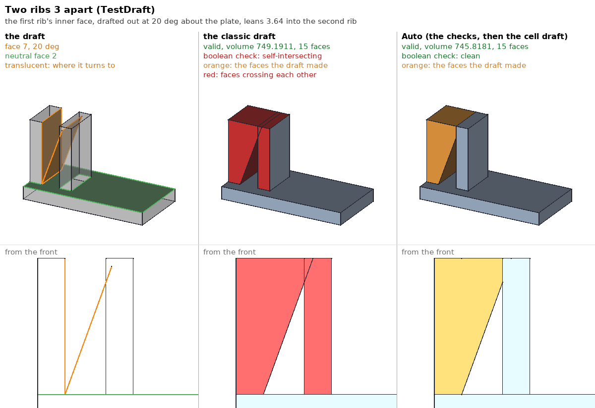
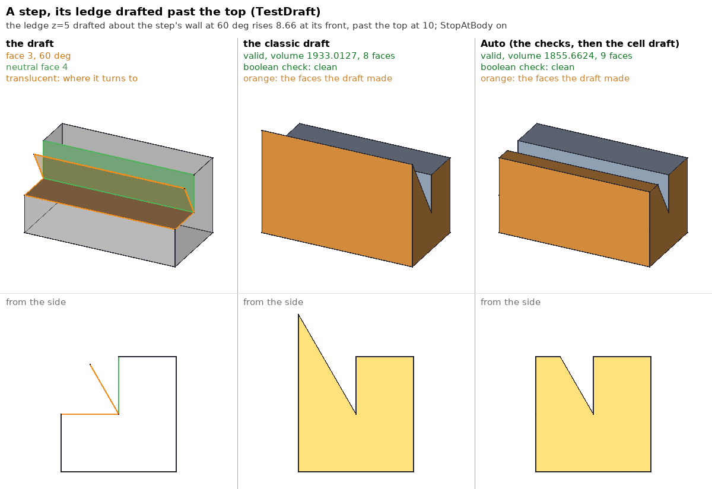
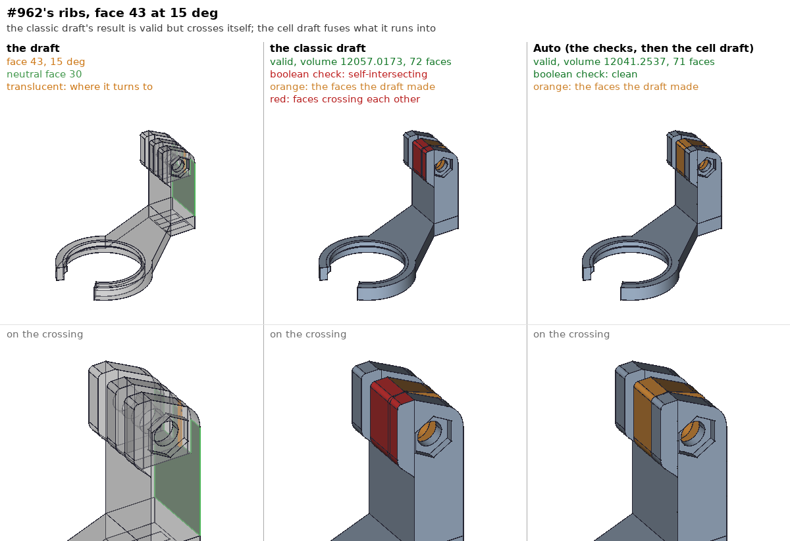
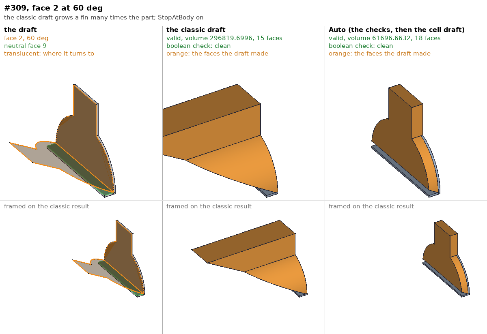
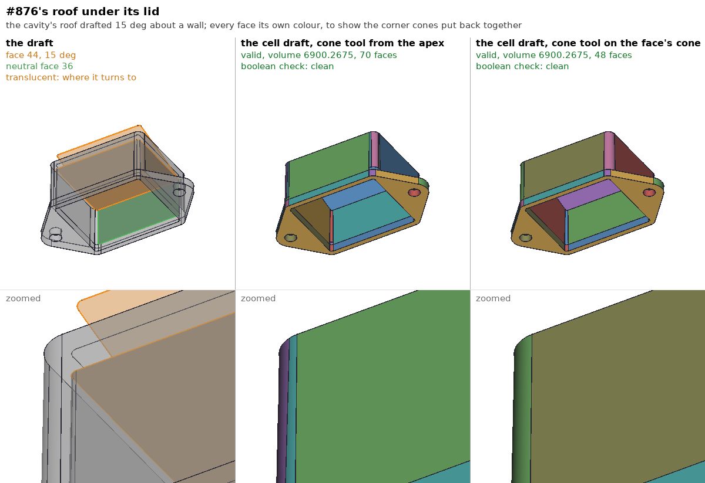
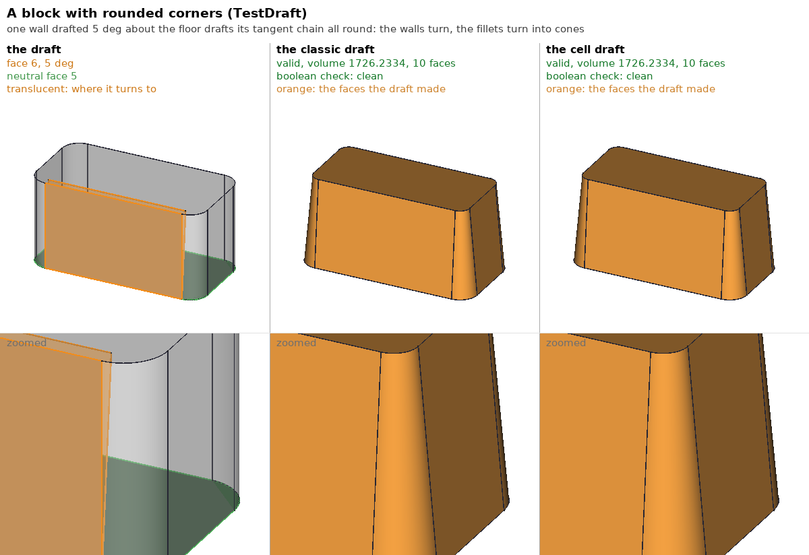
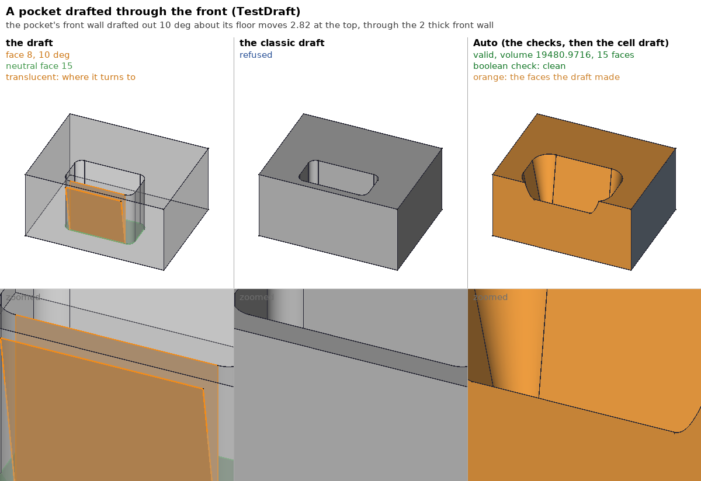
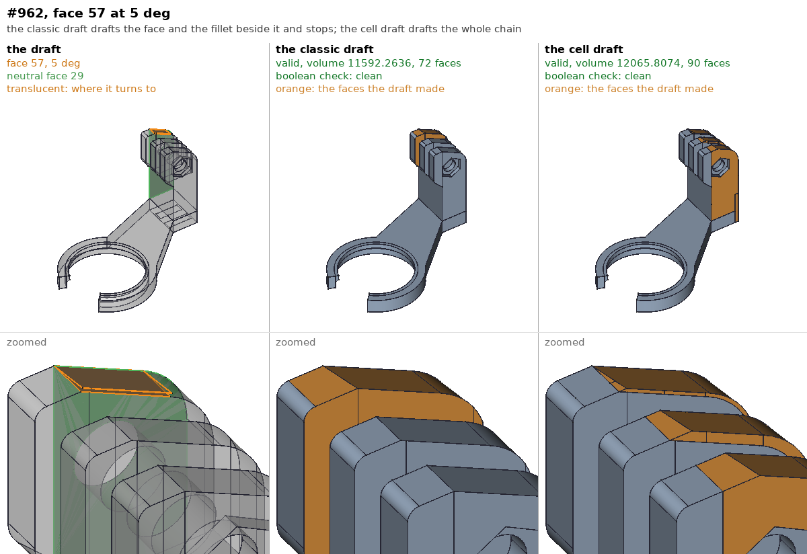
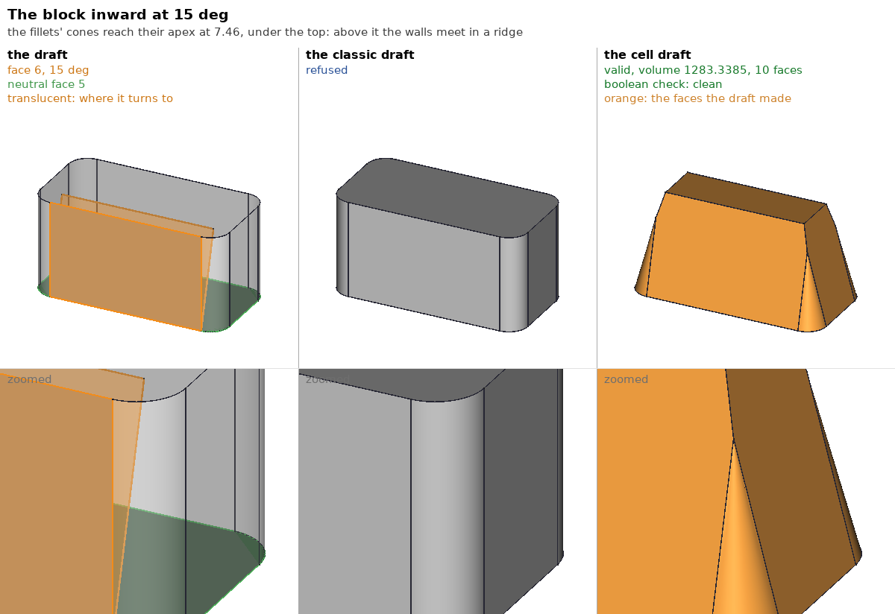
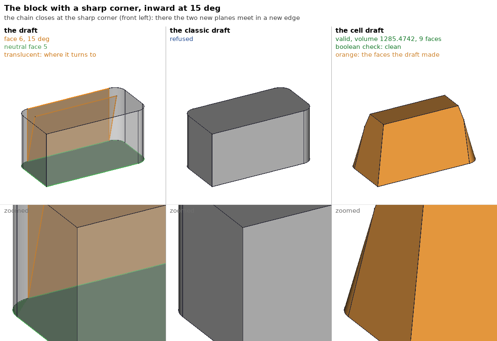

# The new draft -- a draft that can change topology

Status: phase 1 implemented 2026-10-05 -- `Part::CellDraft`
(`src/Mod/Part/App/CellDraft.*`) behind PartDesign's `Method = New` and
Auto's fallback, with `StopAtBody`; section 10 says what the port changed
and measured. Step 3 done 2026-10-06: Auto checks the classic draft's
result and takes the cell draft where it crosses itself or grows past the
body (section 11, with pictures); #876's cones and the internal edges in
section 12. Step 4 done 2026-10-07: tangent chains -- walls and the fillets
between them drafted as one sheet, fillets turned into cones (section 13).
2026-10-08: past a cone's apex the walls meet in a ridge, and a chain may
close at a sharp corner between two planes (section 14); a coarse fuzzy
try for neighbours tangent to each other (section 15); tolerances the fuse
widened, brought back (section 16).
The design below came with a Python prototype (section 5)
that the earlier measurements come from; the open questions settled
2026-10-05 (section 9).

Related: `PartDesign::Draft::Method` (fcad `2ed87066ea`), the fork's draft
fixes and suite (`occt/tests/fork/draft/README.md`), the draft pictures
(`occt/tests/fork/draft/models/Draft.md`).

## 1. What is asked

A PartDesign Draft turns faces about their line with a neutral plane, so
that each makes the given angle with the pull direction. The draft OCCT
offers, `BRepOffsetAPI_DraftAngle`, refuses many drafts a user would expect
to work. The fork made it refuse instead of handing back invalid solids
(2026-10-04), and gave PartDesign's Draft a `Method` property (2026-10-05):

- **Classic**: today's draft, nothing else.
- **New**: refine the base (unless its feature refines already), then draft.
  This document replaces what New does.
- **Auto** (default): Classic; if it fails, New.

Agreed then (2026-10-04/05): the real new draft is a draft that can change
topology -- a Parasolid-style local operation or a boolean rebuild --
designed here first, then built, behind `Method = New` and Auto's fallback.
Error reporting is not done on its own: it is folded into this work, so
that what the new draft still cannot do is said precisely (an angle too
steep for the face, a face that does not meet its neighbours, ...).

## 2. Why the classic draft refuses

`Draft_Modification` is a `BRepTools_Modification`: it gives each face a
new surface, each edge a new curve and each vertex a new point, and keeps
the topology -- every face, edge and vertex of the input is in the result,
connected as before. A draft whose true result has a different topology
cannot be made that way:

- a drafted face swept past the edge of a face beside it: the slot wall
  that breaks through the block's front (`slot_wall_a15`), a narrow wall
  at 5 deg;
- a face that touches the drafted face at a vertex only, which the
  drafted face's corner leaves (`notch_bevel_ledge_*`): the result needs a
  new edge there;
- a face that would shrink to nothing (`notch_ledge_a45`), or an edge;
- a wall split in coplanar pieces, one piece drafted (refine merges them,
  which is what New does today).

The fork's checks (`Draft_Modification::Perform`, and the face check in
`BRepOffsetAPI_DraftAngle::Build`) turn each of these into a refusal.

### 2.1 Census of what is still refused

The draft sweep: every planar face of 29 shapes (the fillet sweep's 25
and #334's four Draft inputs) drafted about each planar face beside it, the
pull direction the neutral plane's normal, at 5, 15 and 60 deg -- 8982
drafts. Classic: 3549 valid, 893 that were invalid are now refused (and
some thousands refused before any of the fork's work, not counted here).
Of the 893, Auto (refine + classic) turns 113 valid (as of 2026-10-05). The
census below is of the remaining 741, each drafted again on the input and
on the refined input with a TKOffset that prints which refusal fired.

| Count | Refusal (classic, on the input) | What it is |
|------:|---------|------------|
| 578 | face check: a self-intersecting wire | a drafted face swept past an edge of a face beside it; that face's outline crosses itself |
| 42 | face check: an inner wire run into the outer one | the same, through a face with a hole |
| 27 | face check: a face turned inside out in the shell | the drafted face turned past its neighbour, nearly all at 60 deg |
| 23 | face check: wires not closed, unorientable faces | |
| 71 | `Draft_VertexRecomputation` (a vertex off an unchanged edge's curve) | a wall split in coplanar pieces; on the refined input 16 are left |

No refusal comes from `FindRotation` or from an edge's or a face's new
geometry: in this sweep every new surface and curve exists. On the refined
input the classes keep their sizes, but for the split walls (71 -> 16), two
edges that turn round (`Draft_EdgeRecomputation`) and 36 drafts that come
out valid -- where OCCT's `UnifySameDomain` merges faces that FreeCAD's
refine guard leaves alone (#334's inputs, whose refine changes the volume).

The first row is the face check: the modification went through, and a
face it rebuilt crosses itself. Every class is a topology change; none is
a numerical miss of the kind the fork's earlier fixes dealt with.

A caution on the inputs: #334's Draft001/002/003 inputs (513 of the 741)
are themselves earlier Draft outputs, and Draft002/003 carry a vertex of
tolerance 27.8 (the stored Draft001 result, `occt-fillet-work` notes). The
measurements in section 5 report them apart.

### 2.2 Not every valid classic result is right

`BRepCheck_Analyzer` checks each face against its own edges and wires, not
one face against another. A drafted face that runs into a different part
of the solid without sharing an edge with it -- #962's ribs, 3.4 apart,
one leaning 4.15 into the next at 15 deg; #334's first input at 60 deg --
leaves two faces crossing, and the classic draft returns that solid as
valid. OCCT's boolean argument check (`BOPAlgo_ArgumentAnalyzer`, Part's
`check(True)`) reports it self-intersecting. The cell draft fuses the
rib into its neighbour instead: a clean solid, 15.76 less volume than
the classic one counts (the overlap, counted twice). Section 5.3 counts
how often this happens among the classic draft's valid results.

Auto takes the classic result as it is, so it hands these on. Catching
them would take a self-intersection check after every classic draft --
of the drafted faces against the rest, not the whole solid -- and then
the cell draft. Decided: measure its cost first (section 8, step 3).

## 3. Approaches considered

**(a) Topology repair on the modification (Parasolid's local operation).**
Keep `Draft_Modification`'s geometry and resolve each topological event it
runs into -- an edge shrinking to nothing and turning round, a face
vanishing, a vertex-only contact needing a new edge -- by editing the
topology: merge vertices, delete the edge, insert the edge. This is what
the commercial kernels do. Each event has its own repair and the events
interact (an edge vanishing next to a face vanishing); OCCT has none of
the machinery, and the classic code's own fragility (section 2's list of
refusals took four fixes to make honest) argues against building on it.
Rejected for now.

**(b) The offset engine.** `BRepOffset_MakeOffset` in Complete mode
rebuilds topology by intersecting every face's new surface with its
neighbours' and choosing the valid splits -- exactly a topology-changing
"replace the surfaces" operation, with offset surfaces. A draft would be
the same with zero offset on most faces and a turned surface on the
drafted ones. It is 8000 lines, the other box's active field (thickness),
and zero-offset faces are a case it treats specially. Too much shared risk
for a first version; worth a second look once the cell draft below exists
to compare against.

**(c) A wedge per face, by booleans.** The draft of a planar face adds
the wedge between the old and the new plane on one side of the hinge line
and removes it on the other. Building the wedge as a solid needs its
lateral bounds -- the neighbours' surfaces -- and for a non-convex face
(an L-shaped wall) the wedge is not an intersection of half-spaces. (d)
is (c) without having to build the wedge.

**(d) Cell selection (chosen).** Split space around the solid by the
solid's faces, the drafted face's new surface and its neighbours' surfaces
extended; every resulting cell is entirely in or out of the result; choose
the cells. Everything hard -- the intersections, the new edges, a
neighbour swallowed or extended -- is the general fuse's job, which is
OCCT's most exercised algorithm and keeps a full history of every piece.
What is new is only the choice of cells, which is a flood fill over cell
adjacency with exact rules (section 4.4). Section 5 measures it.

## 4. The cell draft

Terms, for one drafted face `F` of solid `S`:

- `P`: the surface of `F` (a plane, phase 1); `n` its outward normal.
- `P'`: `F`'s new surface -- `P` turned about the hinge line `P x N`
  (`N` the neutral plane) as `Draft_Modification` computes it
  (`FindRotation`; section 4.1).
- `G_1 .. G_k`: the faces sharing an edge with `F` (its neighbours).
- The **swept region** `K`: the space the face passes through on its way
  from `P` to `P'` -- between `P` and `P'`, bounded laterally by the
  neighbours' surfaces.

The result is `(S - K) + (K inside P')`: outside the swept region nothing
changes; inside it, `P'` decides. Where `P'` leans out, the cells of `K`
outside `S` are added (the neighbours grow to meet `P'`); where it leans in,
the cells of `K` inside `S` are taken away (neighbours shrink, and a
neighbour entirely inside `K` is gone). A feature of `S` that lies in `K`
is consumed, as a boolean would consume it.

### 4.1 The new surface

`P'` comes from the same computation as the classic draft:
`Draft_Modification`'s private `NewSurface(S, Oris, Direction, Angle,
NeutralPlane)` and its static `FindRotation`, which FreeCAD copies for the
plane (section 6). Failures here are the first error class:

- `F` parallel to the neutral plane (no hinge line);
- the angle too steep: `|sin(angle)|` not below the pull direction's
  component across the hinge line (`FindRotation`'s `denom`);
- a surface the draft cannot turn (phase 1: anything but a plane).

### 4.2 The splitting faces

Inside a box `B` around `S`, the general fuse (`BOPAlgo_Builder`, run
non-destructive: a fuse may otherwise raise tolerances on its arguments in
place, and the prototype's sweep did exactly that to its input until each
draft got a copy) takes `B`, `S`, and:

- a face on `P'` covering `B`;
- each neighbour's surface, extended past `B`:

| Surface | Extension |
|---------|-----------|
| plane | a face covering `B` |
| cylinder | a solid cylinder running past `B` at both ends |
| cone | a solid cone, the nappe the face is on, from the apex past `B` |
| sphere, torus | the solid |
| extrusion, revolution, B-spline, offset | `GeomLib::ExtendSurfByLength` by the draft's largest displacement of `F`'s boundary; refused (error) if the extension cannot close the swept region (section 4.4) |

A surface of revolution goes in as a solid, not as its full-turn face.
The prototype first used the face: #523's corner post is a cylinder whose
seam lies in the plane of the box's front wall, another neighbour, and the
fuse lost the cells over the post on one side of it -- a valid solid 0.467
short, exactly the wedge it should have added there (`tan 5 deg` times
`2 r^3 / 3`). As a solid, with the fuse's cells outside `B` dropped, the
draft comes out at the exact volume.

How far to extend: only as far as the swept region can reach, not across
the whole box. The prototype extends every neighbour across `B`, and a
gear-like face of #334 (face 29 of the repaired Draft002 input: a disk
with 94 neighbours, 32 teeth of plane, cylinder, plane) gave a fuse of
some 125 surfaces each cutting all the others; it ran for minutes per
draft and was stopped. The implementation extends each neighbour by the
largest move of `F`'s boundary (section 4.2's margin) beyond its own
face, trimmed to a box around `F`'s swept band, and fuses inside that
box only; the rest of `S` is not split at all. This is part of step 2
of section 8, not a later optimisation.

The cells are the solids of the fuse; each lies entirely in or out of the
result. Which cells are pieces of `S` is the fuse's history, never a
point-in-solid test: on #474's helical part the prototype's point test put
cells worth 2414 "in" a solid of 1887, and the draft came out invalid; by
the history it comes out at the classic draft's volume. (In Python the
history only maps a solid passed as itself, not one inside a compound.)

`B`'s margin around `S` is the larger of `S`'s diagonal and twice the
farthest move of `F`'s boundary (a vertex's distance to the hinge line
times the tangent of the turn). A swept region can be bounded and still
larger than that -- neighbours that flare out, or the far side of a hinge
line crossing the face at 60 deg (#876's frame, a fin 86 long under a
plate 3 thick) -- so a region that reaches `B` is tried again in a box 4
and then 16 times larger before it counts as open (section 4.4).

### 4.3 The drafted face's set

- A neighbour coplanar with `F` (same plane, same orientation -- a face
  split in pieces) cannot bound the swept region: it is drafted with `F`,
  as one face. This is the agreed behaviour of today's New (select one
  piece, the whole merged wall drafts), without refining the rest of the
  body. It differs from the classic draft where that drafts one piece
  alone: `mini_finbase`'s block side and the fin above it are one wall in
  two pieces; the classic draft tilts the lower piece about the hinge
  (+10.94 at 5 deg), the cell draft the whole wall (+10.94 below the
  hinge, -10.63 above it). Auto runs the classic draft first, so only
  `Method = New` sees the difference.
- A neighbour tangent to `F` (a fillet) must follow the draft to stay
  tangent; the classic draft does this by propagating the draft along
  the tangent chain. Phase 1 refuses it with its own error; phase 2 drafts
  the chain (section 4.7).

### 4.4 The swept region

`K` is a set of cells, found by a flood fill:

- **Seeds**: for each piece of `F` (the fuse splits `F` where `P'` and
  the extended neighbours cross it), the cell beside it on the side where
  `P'` lies -- outside `S` where `P'` leans out, inside where it leans in.
  For a plane, the side is the sign of `P'`'s distance at a point of the
  piece, and which of the piece's two cells is outside comes from the
  piece's orientation in each (not from a point inside the cell); a
  piece lying in `P'` itself (on the hinge line) seeds nothing.
- **Fill**: from a cell in `K`, cross any face to the cell beyond, except
  a piece of `P'`, of `F` (the old face), or of a neighbour's surface --
  its own face or its extension. Those are `K`'s boundary.
- **Leak**: a cell of `K` that touches `B`'s boundary, in the largest box
  of section 4.2, means the region is not closed: the drafted face does
  not meet some neighbour. So does a seed, or a cell the fill crosses
  into, that does not lie between `P` and `P'`: a closed `K` is bounded
  by `P'`, `F` and the neighbours, so a face crossed into a cell outside
  the wedge is a gap in that boundary. The prototype skipped such a cell
  silently, and the port did at first: on #474's ramp at 11 deg the cell
  beside the ledge wrapped round under `P` past the ramp's (too short)
  extension, was skipped, and a valid, boolean-clean solid came out with
  1.4 of the 24.9 the draft adds (section 10). It is a leak now, tried
  again in a larger box, then the second error class. The neighbour the
  leak passed is reported (the last neighbour surface the fill ran
  along).

Two properties make the rules exact rather than heuristic:

- **Add and remove never mix.** The added and removed parts of `K` meet
  only along the hinge line, an edge, never a face; a fill across faces
  stays on one side. So `K`'s cells come labelled: added (seeded outside
  `S`) or removed.
- **A non-convex face needs no special case.** An L-shaped `F`'s
  neighbour surfaces, extended, cut through the column over the other
  arm; that splits the region into more cells, each still seeded from
  the piece of `F` below it.

### 4.5 Choosing the cells

A cell is in the result if it is in `S` and not in `K`, or in `K` on the
added side. The chosen cells must be one piece, joined across faces;
otherwise the draft has cut the solid apart (`SplitsSolid`). A cell of `K`
on the added side that is inside `S` already (a neighbouring feature
reaching into the wedge) stays; one on the removed side that is outside
`S` (a pocket inside the wedge) stays out.

The result's boundary is the faces of the chosen cells that belong to
exactly one chosen cell. Their pieces are put back together by origin,
from the fuse's history: the pieces of one input face become one face
again, and a neighbour's own piece and the pieces of its extension
become one face (the neighbour grown). Pieces are not merged across
origins, and edges of the input are kept: a body with faces split in
coplanar pieces keeps its splits away from the draft. This is
`ShapeUpgrade_UnifySameDomain` limited to pairs of pieces with the same
origin, its history merged into the fuse's (`BRepTools_History::Merge`).

### 4.6 Several faces

PartDesign's Draft drafts several faces with one angle and plane (all the
walls of a boss is the common case). The cell draft drafts them one after
the other, each on the result of the last, the faces found through the
history. A face beside one drafted already meets it with its new
surface, so the corner between two drafted faces is the line of their two
new planes, whichever goes first: at a convex corner the material near the
corner after both is inside both new planes, at a concave corner inside
either, the same as the two half-spaces in either order. A face that an
earlier face's draft swallowed is gone: that is an error (section 4.8),
not a silently skipped face.

### 4.7 Phase 2: tangent chains and turned cylinders

(Built 2026-10-07: section 13 says how, and what it still refuses.)

The classic draft drafts a fillet tangent to `F` along with it (the chain
of faces joined by G1 edges), turning a cylinder whose axis is the pull
direction into a cone and rebuilding a fillet between two drafted walls as
an extrusion along their new edge. The cell draft takes the chain as one
sheet: the new faces of the chain, from `Draft_Modification`'s geometry
for the chain alone, joined along their tangent edges, and extended only
across the chain's outer boundary. `P'` in sections 4.2-4.5 becomes that
sheet; the seed side and the "inside `P'`" test become the side of the
sheet's piece a cell touches (its orientation), which needs no plane.
Phase 2 also takes a single drafted cylinder or cone (to a cone).

### 4.8 What the new draft still refuses

Each refusal names the face (and the neighbour, where there is one):

| Error | When |
|-------|------|
| `ParallelToNeutral` | the face is parallel to the neutral plane |
| `AngleTooSteep` | no plane through the hinge line makes the angle with the pull direction |
| `TurnsOver` | the face would turn by 90 deg or more: its new outward normal points against the old one (an undercut face drafted past the pull direction -- #631's walls at 60 deg turn 108 to 113 deg) |
| `UnsupportedSurface` | phase 1: the drafted face is not a plane |
| `TangentNeighbour` | phase 1: a neighbour is tangent to the face; since phase 2 (section 13), only a neighbour tangent along part of an edge -- one tangent all along it is drafted with the face |
| `NoClosure` | the swept region leaks to the box, or out of the wedge: the face does not meet that neighbour |
| `FaceVanishes` | the drafted face is not in the result (its neighbours meet across it) |
| `SplitsSolid` | the chosen cells are not one piece across faces: the draft cuts the solid in two (#309's 2 thick plate, its bottom tilted through it) |
| `NotASolid` / `Boolean` | the fuse failed, or the result fails `BRepCheck` or the boolean check (self-intersection) -- every result is checked both ways before it is returned |

`FaceVanishes` is a refusal (decided 2026-10-05): the user asked to draft
a face, and a result without it is more surprising than an error.

### 4.9 A drafted face stops at the body

Decided 2026-10-05: by default a drafted face does not grow the body
past its own extent (an option turns the stop off: `SetStopAtBody`,
PartDesign's `StopAtBody`, section 6). Where the face leans out, its neighbours grow to meet it, but not
beyond a face of the body that bounds the whole solid: `notch_ledge_a60`'s
ledge rises 8.66 at its front over a notch 5 deep, and instead of a fin
standing 3.66 over the block's top, the ledge stops at the top's plane
and the top closes over the notch's front.

The rule: on the added side the fill of section 4.4 is also stopped by
the plane of a face of the second ring -- a face beside one of `F`'s
neighbours, not `F` or a neighbour itself -- if the whole body lies on
that plane's inner side (a face of the body's convex envelope). The
plane goes into the fuse like a neighbour's. A plane that the body
crosses (a pocket's wall, a step) does not stop it: it would cut
material that is the body's own.

Measured on the suite (prototype): `notch_ledge_a60` 1927.8312 --
1750 plus the notch's front filled to the top for `y < 5 - 5/tan 60` and
the wedge under the ledge behind that, closed form. The bevelled notch
changes too, and that is the rule working as decided: the bevel bounds
the body, so the ledge's front rises only to the bevel's plane, which
reaches the notch's front edge at its own height --
`notch_bevel_ledge_a5` 1660.2207 against 1660.9361 unstopped, the
difference exactly the part of the wedge over the bevel's plane (the
ledge meets it 0.327 behind the front). Every other suite case is
unchanged. The sweep's count is in section 5.5.

Curved faces of the second ring do not stop the fill in the prototype; a
cylinder or cone bounding the body would be a supporting surface the same
way, to be added with phase 2.

## 5. Prototype and measurements

`celldraft4.py` (session scratchpad; Python on `Part.Shape.generalFuse`):
phase 1 only -- one planar face, planar or curved (cylinder, cone, sphere,
torus) neighbours, a tangent neighbour refused; the pieces of `S` from the
fuse's map, the other pieces (of `F`, `P'`, the neighbours) recognised
geometrically; neighbours extended across the whole box (not locally,
section 4.2); the box grown on a leak; the result's faces merged by
`removeSplitter` (all of them, not by origin -- good enough to measure
validity and volume). As FreeCAD's New today, it drafts the refined base
when the refine keeps the volume. Each sweep ran one FreeCAD process at a
time, a case that took over 120 s killed and recorded.

### 5.1 The suite's refused cases

| Case | Prototype | Check |
|------|-----------|-------|
| `notch_ledge_a{5,20,44}` | valid, the classic's volume to 1e-12 | |
| `notch_ledge_a45` | valid, 1875 | 1750 + 125 tan 45 |
| `notch_ledge_a60` | valid, 1966.5064 (10 faces) | the ledge rises past the block's top (8.66 over 5); its free sides extend up with it and a fin stands 3.66 over the top: 1750 + 125 tan 60 |
| `notch_bevel_ledge_a{5,20,45}` | valid, the plain notch's volume - 100 (the bevel) | the corner gets its new edge |
| `slot_wall_a5` | valid, the classic's volume exactly | |
| `slot_wall_a15` | valid, 7453.8564 | the wall breaks through at 2/tan 15 = 7.46 above the floor: 7568 - 4 (7.464 + 2 (18 - 7.464)) |
| `slot_wall_a30` | valid, 7437.8564 | likewise at 2/tan 30 |
| `split_floor_corner_a5` | valid, 1151.5110 | the corner slides along the slanted wall to (7.879, -1.0605): 1125 + 5 x 5.3025 |

Every check is closed form and agrees to the printed digits. These are
without the stop of section 4.9, which changes `notch_ledge_a60` and the
bevelled notch (given there).

### 5.2 The sweep

The 893 drafts that came out invalid before the fork's refusals: the
classic draft makes 39 of them valid (a tolerance fix), Auto (refine +
classic) 127 more, and Auto refuses 727. (Two PartDesign runs disagree on
14 cases, refused in one and valid in the other: section 2.1 counts them
refused, this section valid.) The cell draft on all of them, inputs that
pass OCCT's boolean check apart from those that do not (#334's
Draft002/003, #273's Fillet001, #876's Fillet001 -- see 5.4 for #334's
repaired):

| Result of the cell draft | Clean input, Auto refuses | Clean input, Auto valid |
|--------|------:|------:|
| valid | **275** | 130, Auto's volume to 1e-7 |
| valid, another volume than Auto | | 4 -- Auto's self-intersecting (section 2.2) |
| `TangentNeighbour` (phase 2) | 40 | 16 |
| `TurnsOver` | 28 | |
| neighbour surface not extended (B-spline; the prototype has no `ExtendSurfByLength`) | 4 | |
| `SplitsSolid` | 3 | |
| invalid result, `NoClosure` | 0 | 0 |
| total | 350 | 150 |

On the broken inputs (393 cases) the cell draft mostly refuses
(`SplitsSolid` 304 -- the fuse sees the 27.8-tolerance vertex swallow
whole regions), comes out invalid 30 times and valid 23; 13 died or ran
past 120 s. Repaired (5.4), the same faces draft as on clean inputs.

So on clean inputs the cell draft turns 275 of Auto's 350 refusals --
79% -- into valid solids, and refuses the rest for a reason it can name;
phase 2 (tangent chains) is the next largest class.

### 5.3 The classic draft's valid results

Every sixth valid result of the classic draft in the sweep (the #334
inputs) and all of them on the other shapes -- 1500 drafts, 1222 on clean
inputs. The cell draft on the same faces (on the refined base, as New):

| Result of the cell draft (clean inputs) | Count |
|--------|------:|
| valid, the classic draft's volume to 1e-7 | **1095** |
| valid, another volume, the classic result self-intersecting (section 2.2) | 14 |
| valid, another volume, both clean: the whole merged wall drafted where the classic draft drafts one piece (section 4.3; `mini_finbase`, `mini_finwall`, `mini_slot_*split`) | 12 |
| `TangentNeighbour` (phase 2) | 57 |
| neighbour surface not extended (B-spline) | 21 |
| `TurnsOver`, `SplitsSolid` | 3 |
| invalid, or not boolean-clean: #474 Fillet003, faces beside its helical ramp | 19 |
| total | 1222 |

The last row is the prototype's open defect. Its volumes are within 0.03
of the classic draft's, but the solid is invalid. The ramp's long helical
edges come out with an invalid range after the prototype's global
`removeSplitter` merges them. Without that merge BRepCheck passes, but
the boolean check still reports errors (and the volume is off by 7e-6).
The implementation merges pieces only by origin and keeps the input's
edges (section 4.5), which removes the first cause. The second is still
to be understood, with the fuse's fuzzy value as the first thing to try.
Until then, the result checks of section 4.8 turn such a draft into a
refusal (`NotASolid`) instead of a bad body.

No case was found where the classic result is clean and the cell
draft's differs for any other reason. Where they differ and the classic
result is not clean, the cell draft is the right one.

### 5.4 #334's Draft002 and Draft003 inputs, repaired

Those two inputs fail OCCT's boolean check before any draft: the stored
Draft001 result they are built on has a vertex of tolerance 27.8 at the
drafted ledge's corner, (18, 7.2, 37.017), where two edges of the bevel
beside it still end at the ledge's old corner -- one 26.7 away (z = 63.7),
one 8.25. The bevel's outline is open by 26.7 and the tolerance hides it.
A tolerance repair does not close it: limiting the tolerance leaves the
faces invalid (a self-intersecting wire), and `ShapeFix` puts 26.7 back.

The repair is the draft done right. The cell draft of Draft001 on its own
input (Pad004, clean: face 35 about face 30 at 85.5 deg) is valid and
boolean-clean, with the ledge's corner at (18, 7.2, 37.017) and the
bevel's own corner kept at (18, 7.2, 63.7) -- the new edge the suite's
README says the true result needs -- and no tolerance over 1e-5 (the
input's own). The later features (Pocket005 to Pocket009) cannot be
recomputed (the document stops at Sketch006), so the region of the bad
faces (box (11, -1.6, 15.7) - (19.9, 10.3, 71.2)) is cut out of each input
and the rebuilt Draft001 put in its place. Every valid face of the inputs
inside that box lies on the rebuilt Draft001 to 2e-12, so no later feature
reached into it. Both repaired inputs are valid, boolean-clean, largest
tolerance 1e-5.

The classic draft, same library, same sweep (every planar face against
each planar neighbour, 5/15/60 deg):

| Input | valid | refused | rejected at `Add` | exception |
|-------|------:|--------:|------------------:|----------:|
| Draft002, as stored | 641 | 607 | 48 | 132 |
| Draft002, repaired | 684 | 690 | 42 | 0 |
| Draft003, as stored | 627 | 627 | 48 | 162 |
| Draft003, repaired | 676 | 728 | 42 | 0 |

The cell draft on what the classic draft refuses on the repaired inputs:

| Result | Draft002 | Draft003 |
|--------|---------:|---------:|
| valid | 430 | 465 |
| `TangentNeighbour` (phase 2) | 71 + 42 at `Add` | 71 + 42 at `Add` |
| `SplitsSolid` | 4 | 5 |
| `NoClosure` | 4 | 6 |
| `TurnsOver` | 0 | 1 |
| invalid result | 1 | 0 |
| face 29, the gear disk (section 4.2): the first cases died or ran past 120 s, the rest not run | 180 | 180 |

Leaving the gear face aside, the cell draft makes 430 of 510 and 465 of
548 of the classic draft's refusals valid. On a sample of the classic
draft's valid results (every sixth, 226) it gives the same volume in 215,
refuses 4 (tangent neighbours), and differs in 7 -- and in all 7 the
classic result is self-intersecting and the cell draft's clean.

### 5.5 The stop of section 4.9 on the sweep

`celldraft6.py`, the same clean-input cases as 5.2 and 5.3:

- Auto's refusals and Auto's valid results (500): 489 the same as
  without the stop. Two change by design: #334's first and
  Draft_base inputs, a face at 60 deg whose fin over the body's top goes
  (2162 less, each). Seven change by under 0.004 or only in how many
  pieces a face is left in (#273, #876: the cap's plane splits a face the
  prototype's merge does not put back). Two more #474 Fillet003 cases by
  the helical ramp turn invalid -- the open defect of 5.3.
- The classic draft's valid results (1222): 1209 the same. Ten change by
  design -- there the classic draft grows the body past a face that
  bounds it, and the stopped draft does not (#309's face 2 at 60 deg:
  classic 296819.7, a fin many times the part; stopped 61696.7; #631's
  walls at 15 deg, 2405 less each). One more #474 ramp case turns invalid.

Under Auto these ten keep the classic result, fin and all: the classic
draft succeeds, so the cell draft never runs. Only `Method = New` stops
them. Holding Auto's classic results to the same rule would need a test
like section 2.2's self-intersection check (does the result leave the
body's convex envelope?) -- to be measured with it in step 3.

## 6. Where it lives: FreeCAD's Part

Decided 2026-10-05: in FreeCAD, not in OCCT. Everything the cell draft
needs is OCCT's public API, unchanged since long before 7.7 --
`BOPAlgo_Builder` and its history, `BRepTools_History`,
`ShapeUpgrade_UnifySameDomain`, `BRepPrimAPI`, `Geom` -- so FreeCAD's own
code runs on every OCCT FreeCAD builds against: the released packages
(the fork's frozen 7.7.2), the fork's 8.0.1, stock OCCT, distributions'
packages, the WASM build. In the fork's OCCT it would exist only where
8.0.1 ships (7.7.2 is frozen, `docs/Backport772.md`) and would need a
`dlsym` bridge. The 7.7/8.0 type differences are handled as FreeCAD
already does (`OCC_VERSION_HEX`).

- `FindRotation` / `NewSurface` (section 4.1) are private in OCCT's
  `Draft_Modification`; FreeCAD carries its own copy of the plane case
  (some forty lines), the classic draft untouched.
- `src/Mod/Part/App/CellDraft.h/.cpp`: `Part::CellDraft`, a
  `BRepBuilderAPI_MakeShape` (constructor with the shape; `Add(face,
  direction, angle, neutral plane)`; `SetStopAtBody(bool)`, default true,
  the stop of section 4.9 -- false lets a drafted face grow past the body,
  the plain local-operation result; `Build`; `Error()` with the face and
  neighbour of section 4.8) whose `Modified` / `Generated` / `IsDeleted`
  read one `BRepTools_History` -- the fuse's, the cell choice's and the
  merges', merged. `F`'s new face is `Modified(F)`; a neighbour grown or
  cut is `Modified` of the neighbour; a face swallowed `IsDeleted`; a new
  edge (the corner of `notch_bevel_ledge`) `Generated` from the faces it
  lies between.
- `TopoShape::makEDraft` gains the method and the stop flag and runs
  `CellDraft` through `makEShape`, so the element map comes from that
  history as for every other operation.
- `PartDesign::Draft`:
  - **New**: the cell draft. The refine-then-classic of today goes away:
    the cell draft drafts coplanar pieces as one face itself (section 4.3)
    and does not refine the rest of the body.
  - **Auto**: Classic; if it fails, the cell draft (decided: no refine +
    classic in between).
  - **`StopAtBody`** (bool, default true): passed to the cell draft's
    `SetStopAtBody`; it has no effect on the classic draft. A file saved
    before the property existed restores it as true. Shown with `Method`
    in the property view and the task panel.
  - Errors: the classic draft's refusal reported with its status and the
    face, edge or vertex it names, as an element name of the base
    (`Draft_EdgeRecomputation` on `Edge12`, ...); the cell draft's with
    its error and face/neighbour names. Auto reports both when both fail.

## 7. Tests

- `tests/fork/draft` (through PartDesign): the refused cases of section
  5.1 again with `Method = New`, expecting the closed-form volumes there
  (with the stop of section 4.9: `notch_ledge_a60` 1927.8312,
  `notch_bevel_ledge_a{5,20,45}` 1660.2207, 1685.2363, 1719.4444); the
  #474 ramp (`NoClosure` in the prototype, which could not extend the
  B-spline ramp; extended, it closes: section 10); a face that vanishes,
  expecting `FaceVanishes`; an L-shaped face; two adjacent walls of a
  boss in both orders (the same solid).
- FreeCAD `TestDraft`: Auto on a slot wall that breaks through (element
  names of the grown and cut faces stable over a recompute).
- The draft sweep with the cell draft, as in 5.2 and 5.3: where the
  classic draft's result is valid and boolean-clean, the cell draft's
  volume is the same (1e-9 relative), but for one piece of a split wall
  (section 4.3) and a face stopped at the body (section 4.9); every
  refused case is either valid and boolean-clean or refused with an error
  from 4.8.

## 8. Steps

1. `Part::CellDraft`, phase 1 (single planar faces, sequential faces, the
   stop of 4.9, all errors of 4.8), the local fuse of 4.2, history;
   `SetStopAtBody`; `TopoShape::makEDraft`'s method; the suite cases
   (both ways for `notch_ledge_a60` and the bevelled notch).
2. `PartDesign::Draft`: `Method = New` / Auto on it, the `StopAtBody`
   property, error reporting for both drafts, `TestDraft`.
3. Measure the self-intersection check after a classic draft (section
   2.2), and an envelope check for a classic result grown past the body
   (section 5.5): their cost on the sweep, and how many classic results
   they turn over to the cell draft. Decide from that whether Auto runs
   them.
4. Phase 2 of the algorithm: tangent chains and turned cylinders (done
   2026-10-07, section 13).
5. Performance beyond the local fuse, if the sweep shows the need.
6. Tangent propagation as an option, off drafting only the picked faces:
   stage 1 refuses a fillet tangent to the drafted face, stage 2 rebuilds
   it (section 17).

## 9. Decisions (2026-10-05)

1. A drafted face that would vanish: refused (`FaceVanishes`).
2. A drafted face stops at the body's faces; it does not grow past the
   body (section 4.9). It is an option, on by default: `SetStopAtBody` in
   the API, `StopAtBody` on PartDesign's Draft.
3. Auto's fallback is the cell draft only; no refine + classic before it.
4. In FreeCAD's Part, not in OCCT (section 6).
5. The self-intersection check after a classic draft: measure first
   (step 3), then decide.
6. (2026-10-06, after step 3, section 11) Auto checks the classic
   draft's result both ways -- the self-intersection check always, the
   envelope check with the stop on -- and on a flag takes the cell draft;
   if the cell draft refuses, Auto keeps the classic result and warns.

## 10. The implementation (2026-10-05/06)

Steps 1 and 2 of section 8: `Part::CellDraft` (`src/Mod/Part/App/
CellDraft.h/.cpp`), `TopoShape::makEDraft(..., cell, stopAtBody)`, and
PartDesign's Draft with `Method = New` on it, Auto falling back to it, and
`StopAtBody`. The refine-then-classic of 2026-10-05 is gone. An error
reads `Cell draft: <Error> on Face<n> (neighbour Face<m>): <why>`, the
faces named in the base shape.

### 10.1 What the port changed

- **Seeds and leaks are strict** (section 4.4 as amended). The prototype
  seeded from cells whose interior point lay between `P` and `P'`, and
  skipped any other cell silently. On #474's ramp at 11 deg the cell
  beside the ledge wrapped round under `P`, past the ramp's extension,
  and was skipped: valid, boolean-clean, and 1.4 of the 24.9 the draft
  adds. Now the seed is the cell on `P'`'s side of each piece of `F` by
  the piece's orientation in it, and a seed or a crossed-into cell
  outside the wedge is a leak (larger box, then `NoClosure`).
- **B-spline and other neighbours are extended** (`GeomLib::
  ExtendSurfByLength`, not in the prototype). #474's ramp closes once
  extended: the ledge drafts at every angle to the exact wedge under it,
  `128 tan(a)` (an 8 x 4 face hinged at its end), where the prototype said
  `NoClosure`. The suite's case is valid now. No `NoClosure` example is
  left in the suite; the sweep has one (10.2).
- **Neighbours are extended locally** (section 4.2): a planar neighbour's
  plane as a rectangle over its own face, grown by how far the neighbour
  must reach across its edge with `F` to meet `P'` (computed at the
  edge's ends, plus the face's largest move), and the whole box when the
  neighbour runs nearly parallel to `P'`. Every tool is clipped to the
  local box `B` (a common with it), so the solid is split only there; its
  pieces outside `B` are kept whole. A rectangle's dangling part ends up
  as an internal face of a cell and is ignored.
- **Tool solids of revolution are made in the neighbour's own frame**
  (the same seam, turning the same way). Made in a frame of their own,
  #876's cone corners and one #334 draft lost cells or came out
  self-intersecting; turning the seam away from the neighbour's made it
  worse. Measured, not derived.
- **A fuzzy retry.** Cells that make no valid solid are fused again with
  a fuzzy value of 1e-6. #876's cone corners are tangent to the walls
  either side, so the extensions touch along lines, and the exact fuse
  can leave a sliver unsplit there (#876's face 4 about face 6 at 5 deg).
- **The merge.** `ShapeUpgrade_UnifySameDomain` with `KeepShape` on every
  edge between pieces of different origin, and on every vertex but one
  where two pieces of one input edge meet. A piece that lies on a face of
  the solid and on a tool (a neighbour's extension over a coplanar face, a
  cap) belongs to the solid's face; on a neighbour's extension and a cap,
  to the neighbour; a cap on a neighbour's plane or another cap's is
  dropped. Without that the split floor of `split_floor_corner` came back
  in 18 pieces. The merge can break a curved face it merges (#876's
  cones: self-intersecting wires); the solid is then merged in its planar
  pieces only, and failing that kept as chosen -- valid, its faces in
  more pieces than needed (#876: 70 faces where the prototype's
  `removeSplitter` made 54).
- **The input is copied first.** The fuse runs non-destructive, but the
  merge edited edges the result shares with the input: #334's Draft input
  grew by 10k characters of BRep a draft, a PartDesign base shape changed
  under its owner, and each draft took longer than the last (6.7 s to
  8 s over six). `CellDraft` works on a `BRepBuilderAPI_Copy` (no mesh)
  whose history heads the operation's: the input is byte-identical after,
  and the same draft takes 1.65 s, flat.
- `TurnsOver` reports `FindRotation`'s own turn (#631: 168 to 173 deg),
  where the prototype took the other root (108 to 113). Both refuse.
- **The box and the extensions are bounded by the solid.** A neighbour
  nearly parallel to `P'` meets it far away, and a face turned by 80 deg
  moves its far edge far: #474's ledge (face 3 about face 7) put both at
  830 to 1670 on a part 30 across, and the fuse in a box that size ran
  52 s and gave cells of negative volume. A neighbour's reach, the box's
  margin and a B-spline's extension are each at most the solid's
  diagonal (the stop cuts growth past the body off anyway; without it a
  leak still tries the larger boxes): the same draft takes 1.8 s, the
  classic draft's volume.
- **The checks run per face**, so that the fuzzy retry sees a result
  that fails the boolean check, and every step of the merge's fallback
  is checked both ways, not by BRepCheck alone. The boolean check names
  what it found (self-intersection, an edge off its face).

### 10.2 Measured

The tests: the suite cases of section 5.1 with `Method = New`, the stop
both ways, closed form (`occt/tests/fork/draft`, `new_*` cases); the
L-shaped face (`1500 -+ 625 tan(a)`, the classic draft's to 1e-12), two
boss walls in either order (the classic draft's), the vanishing face
(`FaceVanishes`; drafted the other way, `386.6083`, closed form);
`TestDraft` +3 (a wall breaking through under Auto, its names stable over
a recompute; the stop both ways; `FaceVanishes`).

The sweep of section 5.2 (clean inputs, 500: Auto's refusals and Auto's
valid results), through PartDesign with `Method = New` and the stop on,
against the prototype `celldraft6.py`:

| C++ against the prototype | Count |
|--------|------:|
| valid, the same volume (1e-7) | 406 |
| valid where the prototype could not extend a B-spline neighbour | 3 |
| valid where the prototype's result was invalid (#474 Fillet003 by the ramp, the open defect of 5.3) | 2 |
| the same refusal: `TangentNeighbour` 57, `TurnsOver` 28, `SplitsSolid` 3 | 88 |
| `NoClosure` where the prototype was valid | 1 |

The last is #876's face 44 (a cavity's roof under a 2 thick lid) about
face 36 at 5 deg: the roof's far edge rises 2.03, through the lid by a
0.03 sliver along a cone corner tangent to the wall beside it, and the
fuse leaves the sliver unsplit at the tangent contact, exact or fuzzy. A
refusal, not a wrong body.

The classic draft's valid results (1222, the set of section 5.3), the
same way:

| C++ against the classic draft | Count |
|--------|------:|
| valid, the classic draft's volume (to the 4 decimals recorded) | 1105 |
| valid, another volume -- the prototype's own (split walls drafted whole, 4.3; the stop, 4.9; classic results that self-intersect, 2.2) | 36 |
| valid, another volume, the classic result self-intersecting (#474 Fillet003 face 3 about 7 at 60 deg; the prototype could not extend the ramp) | 1 |
| valid, 0.0172 under a clean classic result (9e-6 relative; #474 Fillet002 face 10 about 8 at 5 deg, its growing neighbour the B-spline ramp, extended by `ExtendSurfByLength`'s own continuation, not the helicoid's) | 1 |
| refused: `TangentNeighbour` 57 (phase 2) | 57 |
| refused: `NotASolid`, the boolean check finds two collinear edges overlapping (#474's ramp parts; the solid of chosen cells has them already, before any merge) | 19 |
| refused: `FaceVanishes` (#474 Fillet003, face 11 at 15 deg and face 22 at 5; the prototype's were valid at the classic volume: open) | 3 |

Against the prototype on the same cases: the same volume in 1109, valid
where it was not in 32 (17 by extending a B-spline neighbour, 12 of its
invalid results by the ramp, 2 it refused as turning over -- the other
root of `FindRotation` -- and 1 `SplitsSolid`), and it valid where the C++ refuses in 11
(9 `NotASolid`, 2 `FaceVanishes`, all on #474's ramp parts). Under Auto
none of these is seen: the classic draft succeeds first. A refusal on
those parts can be slow, every retry and fallback checked (#474 Fillet002
face 10 about 11 at 60 deg: 94 s for two recomputes).

A PartDesign Draft on a base with a placement recomputes in the global
frame the first time and in the base's own after (the suite's
README, #474): the sweep recomputes each draft twice and measures the second.

Time, the same draft repeated (#334's Draft input, 187 faces): 1.65 s,
of which the boolean check of the whole result is 0.84, the merge 0.25,
the fuse 0.17; the classic draft takes 0.16. Restricting the boolean
check to the drafted region (section 2.2's "drafted faces against the
rest") is the next saving.

## 11. Step 3: checks after the classic draft (2026-10-06)

Two checks a classic draft's valid result could get before Auto takes it:

- **Self-intersection** (section 2.2): the boolean check's self-intersection
  and curve-on-surface tests, on the faces the draft made against the rest.
  The made faces are the result's faces that are not faces of the input
  (`BRepOffsetAPI_DraftAngle` keeps every face it does not touch), which
  are the drafted faces and their neighbours.
- **Envelope** (section 5.5): does a made face reach past a plane that the
  cell draft's stop would cap at -- a plane of the second ring with the
  whole input on its inner side (section 4.9) -- by more than its
  tolerance? Sampled at the made faces' vertices and three points along
  each of their edges, as the stop samples the body.

Measured on the classic draft's valid results of section 5.3 (1222, clean
inputs), through PartDesign (`Method = Classic`), with a temporary probe
after each draft, against the cell draft (`Method = New`, the stop on) on
the same cases:

| Classic result | Cell draft | Count |
|--------|--------|------:|
| self-intersecting (#334's Draft input at 60 deg 10, #962's ribs 4, #474 Fillet003 face 3 at 60 deg 1) | valid, another volume | 15 |
| past the envelope (#309, #273, #631's walls, `mini_ab_r3`, `mini_armblock2`) | valid, the stopped volume | 10 |
| past the envelope (#876's face 1, 6, 10, 12 at 5 and 15 deg, by 0.26 and 0.80) | `TangentNeighbour` (phase 2) | 8 |
| neither | valid, the classic draft's volume | 1096 |
| neither | valid, another volume: split walls drafted whole (4.3) 12; #631 within 1e-8 relative (the recorded volume's precision) 9; #474's 0.0172 of 10.2 1 | 22 |
| neither | refused (`TangentNeighbour` 49, `NotASolid` 19, `FaceVanishes` 3) | 71 |

No result the cell draft reproduces is flagged, and every flagged result
is one where the cell draft builds another body (or cannot yet). The
split walls are the one class where the two differ unflagged; there the
classic result is clean and only drafts the piece selected.

What the checks cost, against the draft's recompute (PartDesign's whole
recompute, less the probe):

| | Sum (1222) | Median | Max |
|--------|------:|------:|------:|
| the draft's recompute | 418.6 s | 18.0 ms | |
| boolean check, the whole result (what `CellDraft` ran) | 293.4 s | 14.0 ms | 1500 ms |
| the same, on the faces whose box meets a made face | 142.0 s | 10.0 ms | 1406 ms |
| the same, and only pairs that involve a made face | **87.2 s** | **7.1 ms** | 1279 ms |
| envelope | **1.7 s** | **0.2 ms** | 9 ms |

All three self-intersection checks agree on all 1222. The third is the one
kept (`regionCheck` in `CellDraft.cpp`): a `BOPAlgo_CheckerSI` whose
`BOPDS_IteratorSI` drops every pair of shapes neither of which is a made
face or one of its edges or vertices, which also tests only made faces
for intersecting themselves, run on the faces whose box meets a made
face; then the curve-on-surface test on the made faces. Pairs of the
input's own faces are most of a full check's time -- on #334's Draft
input (187 faces) a draft's check drops from 0.9 s to 62 ms (medians) --
and on #474's ramp parts most of it is the B-spline ramp intersected
with its own neighbours, which a draft elsewhere does not touch (0.8 s to
50 ms). Where the draft does touch the ramp, that is the check's
work: #474 Fillet003's face 3, 250 to 300 ms on a draft of 100 ms (profiled: the
ramp against its neighbours 60%, its self-intersection test 15%, the
curve-on-surface test 10%). The large maxima are the self-intersecting #334 cases,
which have to find the intersection.

The rest of the result is taken as clean, which it is when the input is
(the draft did not touch it). On an input that is not clean, the check
now passes a draft that does not touch the defect, where the check of the
whole result refused every draft of that input.

### 11.1 The cell draft's own check

The same check replaces the boolean check of the whole result in
`CellDraft` (section 10.1's per-face checks, the merge's fallbacks). There
a face of the input that the local box cuts comes back from the merge as
a new face, whole: a draft on #334's Draft input makes 28 faces, 22 of
them pieces of faces the box cut, put back together, and one spans the
part, so the faces whose box meets a made face are 163 of 188. A face is
taken as the input's when every piece it is merged from is a piece of a
face of the input and of no tool (the fuse's origins, through the merge's
history): pieces of the input's faces meet each other only where those
faces did. The check of the other 6 takes 0.18 s, of all 28 0.91 s; the
draft, 1.44 s before, 0.68 s.

On the sweep (the 1222 and the 500 of section 10.2, `Method = New`, the
stop on) every case gives what it gave before, result, volume and face
count, in half the time: the 1222 in 1246 s against 2519 s (#474
Fillet003's 60, most of them refusals checked at every retry, 1225 s to
322 s), the 500 in 856 s against 1010 s.

### 11.2 Auto

Decided (section 9, item 6): Auto runs both checks after a classic draft
that succeeds -- the self-intersection check always, the envelope check
when `StopAtBody` is on -- through `CellDraft::CheckDraft(input, result,
faces, stopAtBody)`. A flag hands the draft to the cell draft; if the cell
draft refuses (#876's eight, `TangentNeighbour`; since section 13 the check
takes the chain and does not flag them), Auto keeps the classic
result and warns with both reasons. On the sweep that turns the 25
flagged classic results the cell draft can build into its bodies, and
leaves the other 1197 as they were. A document saved with a flagged
classic draft recomputes to the cell draft's body.

`TestDraft.testDraftAutoCrossesRib`: two ribs 3 apart on a plate, the
first one's inner face at 20 deg leaning 3.64 into the second; the
classic result is valid and fails the boolean check, Auto's is the two
ribs fused, `640 + 300 tan(a) - 6 (50 tan(a) - 30 + 4.5 / tan(a))`.
`TestDraft.testDraftAutoStopAtBody`: a block stepped down over its front
half, the ledge drafted at 60 deg past the top; the classic draft makes
the fin, Auto with the stop takes the stopped cell draft, Auto without it
the classic result.

Pictures (`docs/pictures/NewDraft/`, made by `make_newdraft.sh` in
`occt/tests/fork/draft/pictures`): the draft asked for, the classic draft,
Auto. In a result the faces the draft made are orange, and where the
result crosses itself, the faces crossing red; the second row is a view
of its own (the profile, the crossing).

## 12. #876 (2026-10-06)

### 12.1 The cones merge

Issue #876's roof (face 44, under the 2 thick lid) drafted about any of its
walls came back in 66 to 78 faces, where the input has 44: the merge of
section 10.1 broke the corner cones it put back together (a
self-intersecting wire, an unorientable face), and the draft fell back to
merging planar pieces only. The cone's tool was made from its apex
(`BRepPrimAPI_MakeCone`, reference radius 0 there), the face's cone has
its reference radius 1 at z = 3: the same surface, another location and
so another v, and the merge, putting pieces of both on one surface, got
their curves wrong. The tool is now made on the face's own surface
(`revolutionTool()`: the lateral face of the face's `gp_Cone` between two
values of v, past the box or to the apex, closed by planes): the 11 roof
drafts come out in 44 to 48 faces, the same volumes, and a little
faster (the 11 in the sweep, two recomputes each: 15.0 s to 12.5 s).

Two things on the way, both measured:

- The planar caps of such a solid must use their circle the other way
  round from the lateral face. `BRepLib::OrientClosedSolid` turns the
  whole solid, not a face of it; with a cap the same way round the tool is
  not a valid solid, and the fuse leaks.
- The frame must be direct. On #523's corner post the cylinder's own
  position is indirect (axis -z); a tool on it fused into cells inside the
  post that classify as outside (`NoClosure` for the top drafted about
  face 3 at 15 deg). The position is made direct first (`directFrame()`:
  the axis reversed, the seam and the turn kept; v changes sign).

The cylinder's tool stays as it was (`BRepPrimAPI_MakeCylinder` in the
direct frame, from where the box starts): on the face's own
surface, #876's bottom face drafted about face 16 at 5 deg came out 0.34 over the
classic draft's volume, and no cylinder needed merging.

On the sweep (the 1222 and the 500, `Method = New`, the stop on) the only
changes are the 11 roof drafts' face counts; every other case gives the
same result, volume and face count as before.

### 12.2 The roof through the lid: still refused

Face 44 about face 36 at 5 deg rises 2.02 at its far edge, through the
2 thick lid by a sliver at most 0.02 thick, from 0.3 inside the far wall.
At the corner cones, tangent to the walls either side, the fuse does not
split that sliver along the cone: the cell over the cusp between the cone
and the two walls' planes stays one with the sliver over the cavity, and
the fill reaches the wall below the cusp (`NoClosure`, with the tools on
the face's own cones as before). The prototype gave a body (7628.97);
which body is right there -- a slot 0.02 wide opened in the lid -- is a
question for phase 2's tangent chains, where a neighbour tangent to the
next one is handled as one surface.

### 12.3 Internal edges

The pictures showed lines on the ribs' plate in Auto's result where none
should be: internal edges, the first rib's sides extended (section 10.1:
a neighbour's plane goes in as a rectangle) across the plate's top and
bottom. Where a tool's face cuts a face of the solid without splitting it,
the general fuse leaves the cut in that face as an internal edge, and the
merge, which joins faces, keeps it. The solid is valid and boolean-clean,
but the lines are drawn and can be picked. 426 of the sweep's 1554 valid
results had them (1540 edges).

They are taken out of every face of the result (`stripInternalEdges()`,
the history composed with the merge's), before the checks. On the sweep:
none left; 7 of #334's results in fewer faces at the same volume (182 to
163: the internal edges had made the merge fail, and the draft fell back
to merging planar pieces); #474 Fillet002 face 10 about 11 at 60 deg,
`NotASolid` before, now valid at the classic draft's volume (2104.3660);
every other case the same result, volume and face count.

## 13. Step 4: tangent chains (2026-10-07)

Section 4.7, built. Phase 1 refused a drafted face with a neighbour tangent
to it (`TangentNeighbour`); that was 57 of the classic draft's valid results
on the sweep and 57 of its refusals. Nearly all of them are walls and the
fillets between them, ruled along the pull direction -- a boss or a pocket
with rounded corners, #631's S-shaped ramp, #876's plate. The classic draft
drafts the whole chain: each wall turned, each fillet (a cylinder about the
pull direction) turned into a cone through its circle in the neutral plane,
which stays tangent to the walls either side.

### 13.1 The drafted set

The drafted set of section 4.3 grows along tangent edges: from the face, a
face beside it that is coplanar (as before), or tangent to it all along
their edge, the same side out, and so on. It is made of **members**, one per
surface:

- a plane, with the faces coplanar with it, turned about its line with the
  neutral plane (`findRotation`, as in phase 1);
- a cylinder or a cone about the pull direction, with the faces on it (a
  fillet split by slots across it is one member: #962), turned into the cone
  `Draft_Modification::NewSurface` makes (FreeCAD's copy, `newRevolution()`:
  the circle in the neutral plane kept, the angle with the pull direction
  the draft's). It needs the pull direction square to the neutral plane and
  along the axis, as the classic draft does.

A tangent edge between two members is a **seam**. It must be straight and
cross the neutral plane; the point where it does stays (the classic draft's
fixed point of a tangent edge), and the seam turns about it onto the line
of the new cone through it. That line must lie on both members' new
surfaces -- the chain stays tangent -- or the draft is refused.

The drafted face itself may be a fillet: drafting it drafts the same chain.
A face that is in the chain of a face drafted before (the user picked every
wall of a boss) is not drafted again.

Pictures (`docs/pictures/NewDraft/`, `make_newdraft.sh`): the block with
rounded corners, where the cell draft builds the classic draft's solid;
the pocket drafted through the front, which the classic draft refuses;
and #962, where the classic draft stops partway along the chain (13.5).

### 13.2 The new surface is a sheet

`P'` of sections 4.2-4.5 becomes a sheet: on each member's new surface a face
between the new lines of its seams, sewn into one shell along them. Along
the seams it runs past the box, but stops short of a cone's apex. A plane at
an open end of the chain runs on across the box, as `P'` does in phase 1. A
lone cylinder or cone (no seams) turns into the whole cone.

The rest of the algorithm takes the sheet as it took `P'`, but where it used
the plane:

- a seed's side is the new surface of the member its piece of `F` is on;
- whether a cell is between the old and the new surface, and on which side
  of the new one, is judged by the member whose **slab** holds the cell's
  point: the region between the planes through its seams, square to them
  (a plane's strip, a fillet's wedge about its axis). Within its slab only a
  member's own face moves;
- every member's new face must be in the result, or `FaceVanishes` names it;
- the pieces of a member's new face are `Modified` of that member's faces.

A single plane (no chain) goes the phase 1 way, unchanged.

### 13.3 What the sweep found

- **A curved neighbour is extended by its own reach.** A B-spline neighbour
  is extended by the move that sizes the box (section 4.2), which grows with
  the band; a chain's band is the chain. #876's upper box stands on its
  plate with B-spline corners over the plate's fillets, and they were
  extended 18, through the region the plate's next wall sweeps: that wall's
  new face never came into the result. For a chain, a curved neighbour is
  extended by how far it must reach to meet the new surface along the edge
  it shares with the chain, as a planar one is.
- **A neighbour that meets the set only on the hinge has no extension.**
  #876's upper walls stand on the plate's walls at the neutral plane, with a
  crease of 1 deg; extended down past the hinge, they ran inside the wedge
  the plate's walls sweep, at 1 deg where the walls turn by 5, and closed it
  off. Where a neighbour meets the set the set does not move, and it bounds
  nothing.
- **Two planes tangent along an edge and not coplanar stay neighbours**, as
  in phase 1 (#334's stored draft output has such pairs, 1e-7 apart).

The phase 1 paths are untouched: for a single plane the new surface, the
extension of a B-spline neighbour and every neighbour's tool are made as
before.

### 13.4 What is still refused

| Error | When | Sweep |
|-------|------|------:|
| `UnsupportedSurface` | a face of the chain is a cylinder or cone whose axis is not the pull direction (#962's fillets along the top edge of a wall drafted about its end; #334) | 13 |
| `UnsupportedSurface` | a face of the chain is a B-spline (#474's fillets along its ramp) | 12 |
| `UnsupportedSurface` | the chain closes on itself at a sharp edge; a cone of the chain ends at a sharp edge on one side; a tangent edge is not straight or runs along the neutral plane; the new faces would not stay tangent | 2 |
| `FaceVanishes` | a cone reaches its apex within its face: a fillet drafted inward shrinks to a point (a 2 fillet on a 10 tall block at 15 deg) | 1 |
| `TangentNeighbour` | a neighbour (not in the chain) tangent to the set along part of an edge | 0 |

The cone's apex is where the true result changes topology again: above it
the two walls meet in a sharp edge and the fillet is gone. That, and a
chain that closes at a sharp corner, are left open.

### 13.5 Measured

The sweep of section 10.2 again (the classic draft's 1222 valid results and
the 500 of Auto's refusals, `Method = New`, the stop on), against the build
before (phase 1):

| | 1222 | 500 |
|--------|------:|------:|
| the same result, volume (1e-9 relative), face count and boolean check | 1165 | 443 |
| `TangentNeighbour` before, valid now | 38 | 40 |
| `TangentNeighbour` before, refused now (13.4) | 19 | 17 |
| anything else changed | 0 | 0 |

Of the 38 valid where the classic draft is valid too, 34 are its volume
(to the 4 decimals recorded; #631's within 1e-7 relative). The other 4 are
those of #962: there the classic draft drafts the chosen face and the fillet beside
it and stops, leaving a crease between the fillet and the wall beyond it
(it follows edges stored as G1, the cell draft the geometry); the cell draft
drafts the whole chain, the wall and the fillets and the slanted faces past
the slots (+473.5 and +83.4). Of the 40 the classic draft refuses, 32 are
the walls and fillets of #962 cut by its slots, 4 #631's ramp and 4 #876's
plate at 60 deg.

The refusals where the classic draft is valid: 13 `UnsupportedSurface`
(#474's B-spline fillets 12, #334 1) and 6 `NotASolid` on #631's ramp, where
the chain's fillet ends at the corner of two neighbours that are tangent to
each other (a cylinder and the plane beside it): the new cone cuts the pair
where they touch, and the fuse leaves an edge 0.0007 long whose vertex's
tolerance takes in the next vertex -- the self-intersection test refuses it.
The tangent contact of section 12.2 again, between neighbours this time.
One of the 6 drafts' siblings comes out valid at the classic volume with two
edges that small (the boolean check's small-edge test, which the cell
draft does not run). Where the classic draft refuses too: 14
`UnsupportedSurface`, 1 `FaceVanishes` (a cone's apex), and 2 `SplitsSolid`:
the upper box of #876 drafted about its plate, its walls already at 1 deg and
their chain ending at B-spline corners tangent to them to 1e-5 only, which
the 1e-6 test takes for neighbours; their reach (the new surface nearly
along them) runs to the limit and the region leaks.

Time: the 78 valid chain drafts take 0.43 s (median, PartDesign's second
recompute), at most 1.34 s; the phase 1 drafts as before.

The suite (`occt/tests/fork/draft`, `new_chain_*`): the filleted block
drafted from a wall both ways and from a fillet, `20 x 10 x 10 - 30 t 100 +
4 t^2 1000 / 3 - (4 - pi)(40 - 200 t + 1000 t^2 / 3)` with `t = tan(a)`;
inward at 15 deg refused (`FaceVanishes`); and a pocket with rounded
corners 2 behind a block's front, drafted outward through the front wall
(at 10 and 20 deg the classic draft refuses), at the volume of the block
less a ruled loft between the floor's outline and the top's. `TestDraft`
+2: the filleted block (Classic and New, from a wall and from a fillet),
and the pocket through the front under Auto.

`CellDraft::CheckDraft` (Auto's check of a classic result, section 11) takes
the chain as the cell draft does: the faces of a chain are not caps of each
other. Section 11's eight #876 results "past the envelope" were the plate's
walls past the planes of the other walls of their own chain; with the chain
they are not flagged, and the cell draft builds the classic draft's solid
for them anyway (34 above).

## 14. Past a cone's apex, and a chain that closes at a sharp corner (2026-10-08)

The two topology changes section 13.4 left open.

### 14.1 Past a cone's apex

A fillet between two walls drafted inward turns into a cone that narrows as
it rises; on a block 10 tall with fillets of 2 at 15 deg it reaches its apex
at 2 / tan(15) = 7.46. Above that the fillet is gone and the two walls meet
in a sharp edge -- the ridge, the line of their new planes. It runs from the
apex: both new planes are tangent to the new cone, so both hold its apex.

A cone member with two seams, both to planes, whose apex lies on both new
planes and whose ridge is not square to its axis, gets the ridge (`Member::
ridge`, `apex`, `ridgeDir`, `live` -- the side of the apex its face is on).
Then:

- **The sheet.** The cone's face stops at the apex (a degenerate edge
  there). The side of each plane's face along that seam runs up the seam's
  new line to the apex and on along the ridge (`seamSide`, `ridgeAt`), so the
  two planes' faces meet along it and the sheet stays closed. The ridge is
  the same line on either seam: it lies in the plane of symmetry between them.
- **Distances.** Past the apex, in the cone's own region, the new surface is
  the two planes: the distance of a point is the larger of its distances to
  them where the fillet was convex (the solid inside both), the smaller where
  it was concave (inside either). `newDist` and `newNormalAt` take it, so the
  seeds, the cells' "between" and the neighbours' reach all see the ridge.
- **The next event.** A plane narrows along its ridges; where its two sides
  meet the plane ends too, and the planes beyond its ridges meet in turn --
  the roof of the chain (a hipped roof on the block). That is not built: the
  sheet stops short of the first such crossing (`makeSheet`), and if a face
  of the chain, or where it moves to, lies past it, the draft is refused,
  `FaceVanishes` ("narrows to nothing"). The block at 30 deg: its short walls
  meet at 5 / tan(30) = 8.66, under its top.

A cone whose apex the sheet reaches but that has no ridge (a seam to another
cone, a lone cone, the face all past its apex) is clipped short of the apex
as before, and refused if its face reaches it.

### 14.2 A chain that closes at a sharp corner

A boss with three rounded corners and one sharp: the chain from any wall runs
round to the sharp corner from both sides, and two of its planes meet there
at a sharp edge. That edge is a **sharp seam**: the new edge is the line of
the two new planes, through the point where the old edge meets the neutral
plane (on the hinge of both, which stays). Its new line is not as steep as a
tangent seam's, so a seam carries how far along its line a level is
(`Seam::k`; a level is a height, `seamAt`). A sharp seam bounds neither
plane's region (`inSlab`): across it both planes judge, the first that has a
point between its old and its new plane takes it, which is the convex
corner's union and right for the concave one wherever the fill can reach.
The narrowing of 14.1 is measured along the level line of the plane, so a
plane between a ridge and a sharp seam ends where they cross.

A cylinder or cone of the chain at a sharp edge is still refused.

### 14.3 Two guards

On #876's upper box (faces 26 and 42 drafted about face 5 at 5 deg, section
13.5's `SplitsSolid` pair) the ridge took the sheet past its corners' apex
in the larger box of the second try, and the fuse came back with 7 of the
solid's pieces, 7590 of its 8666: no piece of the drafted faces seeded a
cell, nothing was swept, and the 7 cells made a valid solid -- the wrong one.
Two checks now stop that, for every cell draft:

- the solid's pieces must add up to the solid (to 1e-3: the volume
  integration on B-spline cells is off by up to 8e-5 on the same draft with
  nothing lost), else `Boolean`, and the fuzzy fuse is tried;
- a draft that moves its faces must sweep a cell, else `NoClosure`.

The pair of #876 is refused again, as `Boolean`.

### 14.4 Measured

The suite (`occt/tests/fork/draft`), each against its closed-form volume:
the filleted block inward at 15 and 20 deg (`new_chain_rbox_a15/a20`, the
first refused before), at 30 deg refused (`FaceVanishes`, the short walls);
one filleted edge, an open chain, from the wall and from the fillet
(`new_chain_open_apex*`); the pocket's walls drafted inward, its concave
corners closing at 7.46 over the floor (`new_chain_pocket_apex_a15`); the
block with one sharp corner at 5, -5 and 15 deg and from a wall at that
corner (`new_chain_sharp_*`), and the pocket with one
(`new_chain_pocket_sharp_a15`). At 15 deg the classic draft refuses both
sharp-cornered shapes. All to 1e-15 relative; the angles from 5 to 14 deg,
where the apex lies over the block's top, too. `TestDraft` +1
(`testDraftNewTangentChainSharpCorner`), and `testDraftNewTangentChain`
takes the 15 deg block as valid, with its four ridges, and 30 deg as
refused.

The sweep of section 13.5 again (`Method = New`, the stop on), against the
build before:

| | 1222 | 500 |
|--------|------:|------:|
| the same result | 1219 | 496 |
| refused before, valid now, at the classic draft's volume | 2 | 0 |
| refused before and now, for another reason | 1 | 4 |
| anything else changed | 0 | 0 |

The 2: #474's Fillet003 input, face 11 drafted about faces 9 and 10 at 15
deg. The first box swept nothing and the result left the face out
(`FaceVanishes`); now an empty sweep counts as open and the larger box
drafts it (2006.0216, the classic draft's). The other 5: #876's pair of
14.3; two of #334's chains through its face 10, which close at a sharp edge
(`UnsupportedSurface` before) and now do not close (`NoClosure`); and one
of #334's chains at 60 deg past an apex (`FaceVanishes` both, now from 14.1's
test). The guard on an empty sweep
needs a piece of the drafted faces off the new surfaces: #474's face 22
about 25 at 5 deg moves nothing (the classic draft keeps the volume), and
stays `FaceVanishes`.

The sweep's input shapes had been cleared out of the scratch directory; they
were exported again from the models (the features' input shapes) and the
older scratch, and checked against the last run: on the build before, every
case gives last session's result.

## 15. Neighbours tangent to each other (2026-10-08)

The 6 `NotASolid` of section 13.5 on #631's ramp, where the classic draft is
valid. #631's Fillet002 input, face 7 drafted about face 9: the chain is an
S-shaped ramp of walls and r=49 fillets running along the pull direction.
At its end two neighbours meet tangentially -- face 8, a cylinder of radius
40, and face 9, a plane 40 from its axis -- along a line. The chain's new
cone crosses that line, and there three curves meet: the cone with the
cylinder on either side of the line, and the cone with the plane. The fuse
computes each on its own and puts their common point in two places 0.0007
apart, joined by an edge 0.0007 long whose vertex's tolerance (6.8e-4) takes
in the other end: the boolean check calls it a self-intersection. Neither
the exact fuse nor the fuzzy one at 1e-6 joins them.

- `ShapeFix_Wireframe::FixSmallEdges` on the chosen cells' solid joins them
  and the check passes, but the volume moves by 0.066 (1.7e-6 relative,
  against 4e-8 before): not taken.
- A fuzzy value of 1e-3 joins them in the fuse itself: valid, boolean-clean,
  4.8e-8 from the classic draft's volume. 1e-4 does not.

So the cell draft now tries a third time, with a fuzzy value of 1e-5 of the
solid's diagonal (1.8e-3 on #631), after the exact fuse and 1e-6 have both
failed the checks. A coarse fuse can grow tolerances; its result is refused
(`NotASolid`, naming the tolerance) when a tolerance passes the input's by
more than 4 times the fuzzy value. #631's results hold 2.2e-3 to 5.3e-3
(at most 3 times); #474's Fillet002, face 10 about 3 and about 9 at 5 deg,
came out at the classic draft's volume from the coarse fuse with vertices of
0.21 and 0.036 on a part 30 across, and stay refused.

On the sweep (the 1222 and the 500, `Method = New`, the stop on): the 6
of #631 valid, within 8e-8 of the classic draft's volumes, boolean-clean;
nothing else changes. The suite: `new_chain_issue631_f7_n9_a{5,15}`.

The tolerance bound is the coarse try's only. The exact fuse already grows
tolerances on some drafts. Over the 1222 the cell draft's valid results
hold, as their largest tolerance: under 1e-5 935, under 1e-4 133, under
1e-3 34, under 1e-2 39, more 45. Most of the large ones are the input's own
(#273's input carries 3e-2); grown more than 100 times past the input's,
44, all on #474's ramp parts (up to 6.8e-2, Fillet002 face 10 about 8), #631
(up to 5.3e-3) and #962 (2.6e-3), from the exact fuse as well as the fuzzy
ones. Bounding those too would have refused four of #474's Fillet002 drafts
that come out at the classic draft's volume (face 10 about 3 at 15 deg,
about 11 at 5, 15 and 60, from the 1e-6 try, tolerances 0.09 to 0.29).
Whether such a result should stand is open.

The 18 `NotASolid` left where the classic draft is valid are all #474's
Fillet003 input, faces 25, 27 and 29 drafted about the faces beside them.
That input is valid and boolean-clean, but its face 22 is a sliver: a plane
triangle 2 long and 1e-6 wide (area 9e-7), coplanar with face 23 beside it,
a leftover of the fillet that made the input. The classic draft keeps the
topology, so the sliver stays a consistent sliver, and its 16 results are
valid and clean. The cell draft cuts the sliver's thin end and leaves edges
1e-5 and 1e-6 long whose tolerance (5e-6) takes in their neighbours; the
boolean check refuses that. Giving the sliver no extension of its own does
not change it: the draft has to reshape the sliver itself. Left as it is --
a defect of the input that only a draft keeping the topology gets past.

## 16. Tolerances (2026-10-08)

Section 15 left open whether a result whose tolerances the fuse grew should
stand. Measured on the 48 drafts of the 1222 whose largest tolerance had
grown more than 100 times past the input's:

- **The fuse grows them, not the merge.** The chosen cells' solid, before
  any merge, holds the same tolerance as the result in every case.
- **The classic draft does not.** On the same drafts its results hold 1e-7
  to 1.6e-5 (#631's Fillet003 face 12 about 2 at 5 deg aside, 3.3e-3), at
  the same volumes.
- **Most of it is not needed.** A copy of the result with every tolerance
  set to 1e-7 and raised again only as far as its gaps need
  (`BRepLib::UpdateTolerances`) holds 6e-6 to 3e-5 where the fuse left 1e-3
  to 1.8e-2, and is valid and clean on 25 of the 48. On the others the gaps
  are real, or the input fails the whole check by itself (#474's Fillet003,
  the sliver of section 15).

So a result is now **tightened** (`tightenTolerances`) when its largest
tolerance passes ten times the input's (and 1e-5): every tolerance above the
input's largest is set to that, then raised as far as the gaps need. The
result is kept so only if it passes the whole boolean check as Part's
`check(true)` runs it (`passesFullCheck`); else every tolerance is put back.
The check of the drafted region is not enough: #876's face 4 about 7 at 5
deg, tightened, passed it, and the whole check's small-edge test, which
judges an edge by its vertices' tolerances, found two edges too small.

Then a result whose largest tolerance still passes the input's by 1e-3 of
the part's diagonal is refused (`NotASolid`, naming the tolerance), on every
try; it replaces section 15's bound on the coarse try. 1e-4 was too tight:
the Fillet003 input of #474, face 26 about 28 at 15 deg, holds a real gap of
5.3e-3 on a part 40 across and is clean.

On the sweep (the 1222 and the 500, `Method = New`, the stop on), against
the build of section 15:

| | 1222 | 500 |
|--------|------:|------:|
| the same result | 1218 | 500 |
| tightened (volume, faces and check unchanged) | 41 of them | |
| refused before, valid now, the classic draft's volume | 2 | 0 |
| valid before (not boolean-clean), refused now: tolerance 0.09, 0.28 | 2 | 0 |

The 4 are #474's Fillet002, face 10: about 3 at 5 deg, valid and clean now,
tightened from 0.21 to 1.6e-4; about 9 at 5 deg, valid at 3.6e-2 (it cannot
be tightened; under the bound, not clean as a whole); about 8 at 5 deg and
about 11 at 60 deg, refused. The largest tolerances of the 1222's valid
results: under 1e-5 959, under 1e-4 135, under 1e-3 37, under 1e-2 17, more
42 (nearly all the input's own: #273's carries 3e-2); grown more than 100
times past the input's, 22 where there were 44, all on the ramp parts
of #474 and the tangent pairs of #631. Face 10 about 11 at 15 deg, which held
0.38 from the 1e-6 try, comes out at 6.7e-5. Time: the 1222 take 610 s
against 537 (the full check on the 80 drafts tightening runs for), the 500
407 against 401; the median draft is unchanged.

## 17. Tangent propagation (2026-10-08)

Drafting one wall of a block whose vertical edges are filleted drafts every
wall: the face's tangent chain (section 13) runs through the fillets round
the block. That is what the classic draft does, and what the cell draft
was built to match. It is not what a user who thinks "draft before fillet"
expects: that one wall turns, the fillets beside it follow it, and the
walls beyond them stay as they are.

Other CAD systems make it a choice. SolidWorks' draft has face propagation
(none, or along tangent faces), Fusion's a tangent chain switch, Onshape's
tangent propagation; with it on they draft the tangent fillets with the
face, as we do.

### 17.1 The option

`PartDesign::Draft` gets `TangentPropagation` (bool, default true: today's
draft; a file from before it restores true), and `Part::CellDraft`
`SetTangentPropagation(bool)` (default true), passed through
`TopoShape::makEDraft`.

Off, a face is drafted with the faces coplanar with it beside it (a face
in pieces, section 4.3) and a curved face with the pieces of its own
surface (#962's slots), as before, and with the picked faces tangent to
it -- a wall and the fillets beside it, picked together, draft as one
chain, which is what the user asked for. A face tangent to the set that
was not picked is not drafted; what becomes of it is staged:

1. **Stage 1: refuse.** `TangentNeighbour` (the error phase 1 gave every
   tangent neighbour), saying "a face tangent to the drafted face is not
   drafted; turn tangent propagation on, or fillet after the draft".
2. **Stage 2: rebuild the fillet.** The fillet between the drafted face and
   its untouched neighbour is taken off -- the two faces extended to meet
   in a sharp edge -- and made again on that edge at its old radius: the
   "draft before fillet" result. Between two planes the new edge is a line
   and the fillet a cylinder along it (no longer about the pull
   direction); other neighbours and fillets are refused at first.

### 17.2 The classic draft always propagates

`BRepOffsetAPI_DraftAngle::Add`'s `Flag` is not a propagation switch: it
only defers a cylinder's new surface, and the tangent walk
(`Draft_Modification`) happens either way. So the classic draft cannot be
told to stop at a fillet. With the option off:

- where no picked face has a tangent face that was not picked, the option
  changes nothing, and every method runs as it does with it on (a model
  without fillets drafts as before, the classic draft first under Auto);
- otherwise `Method = Classic` refuses, saying the classic draft always
  drafts the tangent chain, and Auto goes straight to the cell draft
  (`New` takes it anyway).

`CellDraft::TangentFaces(shape, faces)` tells the two apart: the faces of
the picked faces' tangent chains (`draftChain`) that are neither picked
nor coplanar pieces of a picked face.
